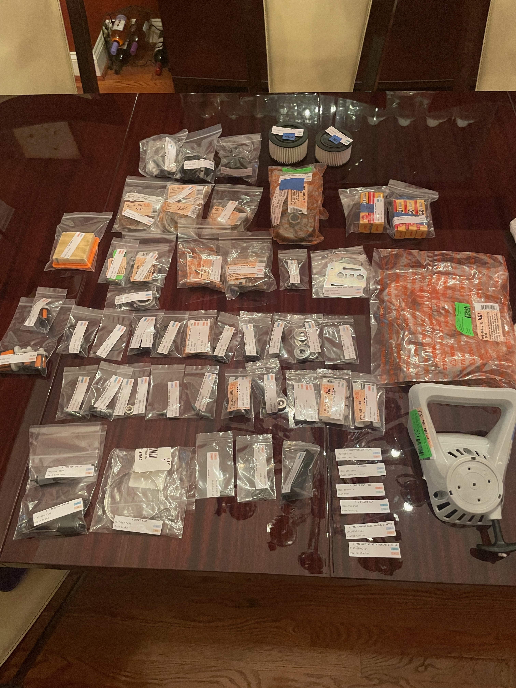
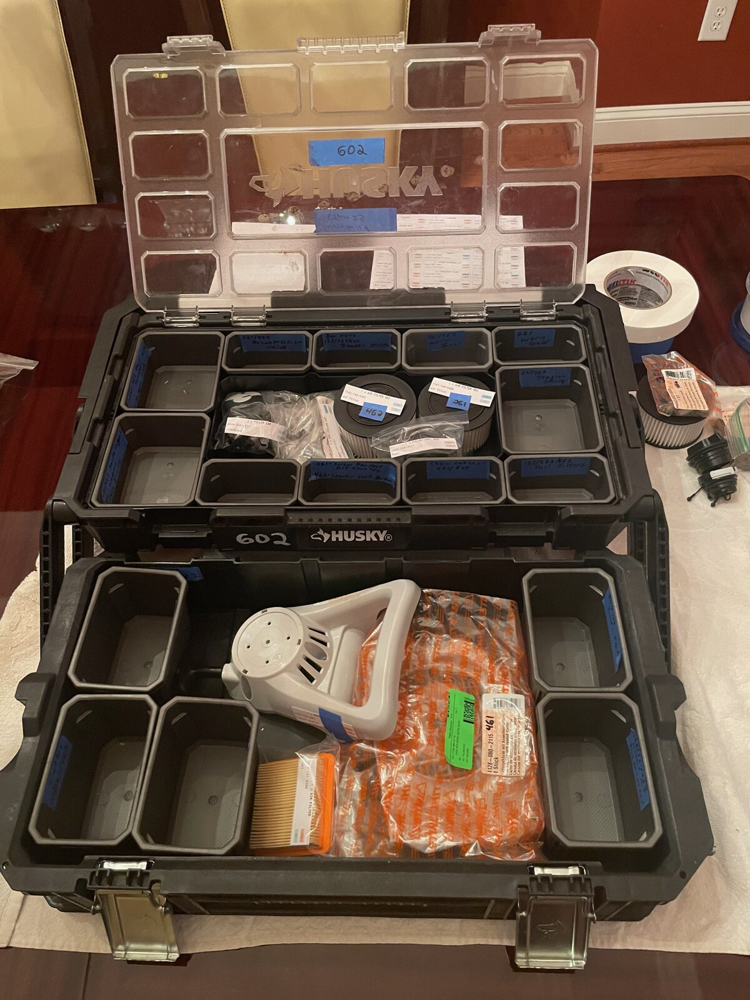
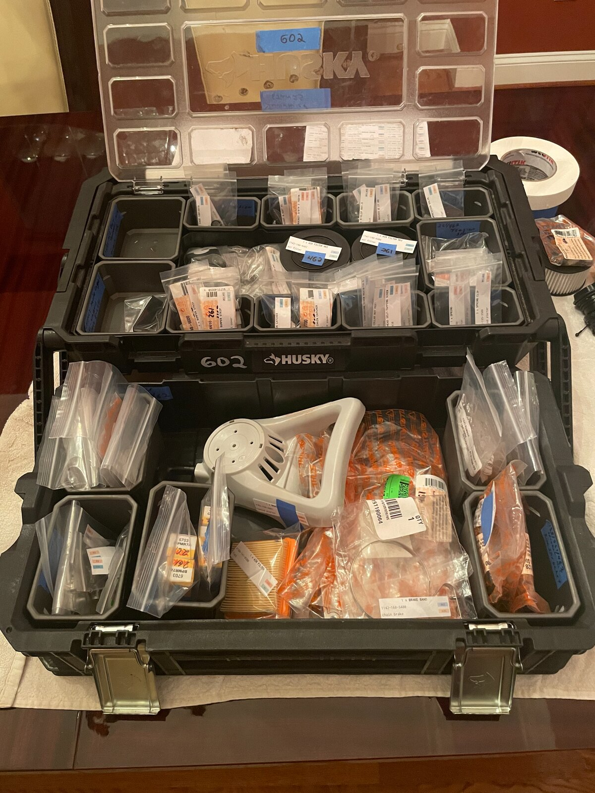

# Field Repair Kit Inventory Management: Documents and Materials

## Materials

These are the materials purchased and used for configuring the FRK:

+ 2"x3" plastic resealable bags
  + each FRK uses approximately 29
  + $4.99 per 100
  + <https://www.amazon.com/dp/B0CMX4BGPT>

+ 3"x4" plastic resealable bags
  + each FRK uses approximately 2
  + $3.32 per 100
  + <https://www.walmart.com/ip/Hello-Hobby-3-x-4-Re-closable-Plastic-Bags-for-Jewelry-and-Craft-Storage-100-Bags-USHH2232/5323687687>

+ 4"x6" plastic resealable bags
  + each FRK uses approximately 23
  + $3.32 per 100
  + <https://www.walmart.com/ip/Hello-Hobby-4-x6-Re-closable-Plastic-Poly-Bags-Jewelry-and-Craft-Storage-Unisex-Gift-bag-Length-6-inches/5323687689>

+ Avery Repositionable Address Labels, Repositionable Adhesive, 1" x 2-5/8", 750 Labels (58160)
  + $15 per 750 labels
  + <https://www.walmart.com/ip/Avery-750-Pack-White-1-x-2-5-8-Repositionable-Address-Labels-for-Inkjet-Printers/14295717>
  + used for parts labeling and toolbox bin labels
    + unique parts count approximately 60
    + bin count 17 plus 2 open areas (toolbox configurations may differ, however)

### Photos

+ FRK parts in bags with labels:
  + 

+ FRK toolbox open areas populated:
  + 

+ FRK toolbox populated:
  + 

## Documents

- [Part references](parts/README.md): model-specific uses, highlighted diagrams and related parts
- [Offline part reference](frk-part-reference.pdf?raw=1): complete indexed PDF with internal links and bookmarks
- [Part labels](frk-parts-labels-avery.pdf?raw=1): one set of 61 labels on three Avery 5160 / 58160 sheets
- [Bin labels](frk-bin-labels-avery.pdf?raw=1): eight copies of each bin label
- [Inventory checklist](frk-parts-inventory.pdf?raw=1)
- [Box map](frk-parts-boxmap.pdf?raw=1)

The [online reference](https://rduncangt.github.io/frk-management/) supports search by part name, number, application and bin. QR codes use permanent part-number addresses under `/frk-management/parts/`.

### Source data

[`frk_items.tsv`](frk_items.tsv) supplies the inventory values to every document. It has no header row and uses these eight tab-separated columns:

| Part Number | Part Name | Count | Saw | Supervision | Bin | Section | Packaging |
| :--- | :--- | :--- | :--- | :--- | :--- | :--- | :--- |
| 9512 933 2260 | Needle cage 10x13x10 | 3 | 261 | AS1 | A2 | needle cages | 2" x 3" |

[`reference/parts.json`](reference/parts.json) records each application: model, manual edition, drawing/table pages, item number, manual quantity, diagram crop/highlight and related-part links. Inventory quantities, names, bins and supervision levels remain in the TSV. `kit_count` controls the number of bin-label sets.

Related links use `[[partnumber]]` or `[[partnumber#application-id]]`. Application-specific links keep an assembly's fasteners separate from their other uses. A reference with an unverified part-number match carries `status: "unconfirmed"` and identifies the number actually listed in the manual.

Diagram sources are in [`reference/figures/`](reference/figures/). Crop and highlight coordinates use PDF points from the upper-left corner of an A4 drawing page. [`scripts/build.py`](scripts/build.py) contains the shared layouts and color roles; web styling is in [`reference/site.css`](reference/site.css).

### Build

Requires Python 3.10+, [uv](https://docs.astral.sh/uv/), and a LaTeX distribution with `pdflatex`, `geometry`, `lmodern`, `inconsolata`, `graphicx`, `xcolor`, `pgf`, `hyperref`, `longtable`, `booktabs`, `array`, `tcolorbox` and `tabularx`.

```sh
make all        # Refresh every PDF, part page, diagram, QR code and the static site
make check      # Validate references, generated PDFs and site links
```

`make` installs the pinned Python dependencies into `.venv`. Build intermediates stay in `.build`. Generated `.tex`, `.pdf`, part pages and `docs/` are committed outputs; edit the shared sources and rebuild them together.

The `labels`, `binlabels`, `inventory`, `boxmap`, `reference` and `site` targets all refresh the complete set, keeping the printed and web versions synchronized. `make generate` refreshes sources and images without compiling PDFs. `make clean` removes the build cache. Set `PDFLATEX=/path/to/pdflatex` when needed.

### Web publishing and printing

GitHub Pages serves the generated `docs/` directory. To publish the pilot, select **Deploy from a branch**, `pan-head-screw-qr-pilot`, and `/docs` in the repository’s Pages settings. The `site_url` in `reference/parts.json` sets QR and PDF destinations; changing the publishing branch does not change those addresses.

Part and bin labels use US Letter Avery 5160 / 58160 geometry: 1 × 2⅝ inches, three columns by ten rows. Print at **100% / actual size**. Each part directory also contains a PDF placing that single label in the sheet's top-left position.

Drawings © ANDREAS STIHL AG & Co. KG. Team Rubicon logo from [Team Rubicon](https://teamrubiconusa.org/).
