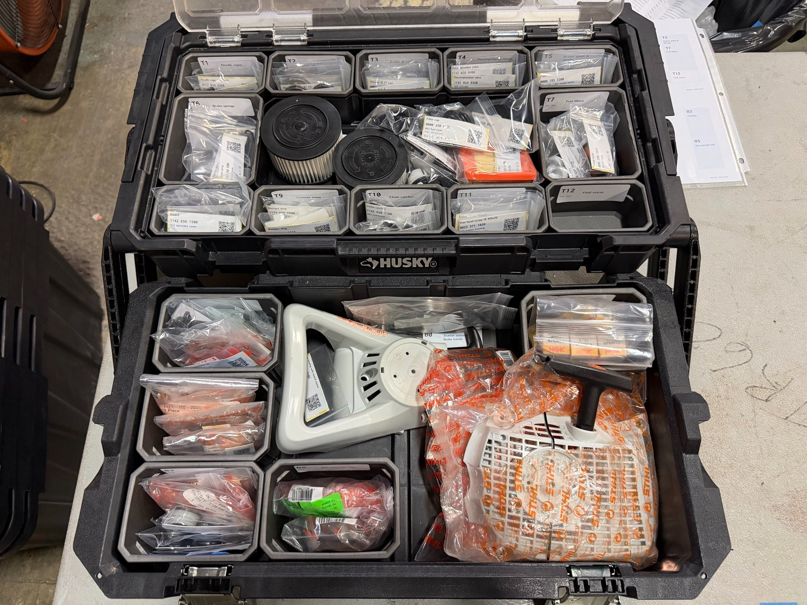

# Field Repair Kits

A standard parts and storage system for Team Rubicon’s chainsaw Field Repair Kits. Find the right part, prepare a kit, and restock it using a consistent layout.

**STIHL HT 135 · MS 261 · MS 462**

**[Find a part →](https://rduncangt.github.io/frk-management/)** · [Documents](#documents) · [Packing guide](kit-packing.md) · [Materials](#materials)

[See the layout and packing photos →](kit-packing.md)

## Documents

### Identify a part

**[Online parts reference →](https://rduncangt.github.io/frk-management/)**

Search by name, number, saw, or bin. Highlighted diagrams show where each part fits, with links to related parts and printable reference sheets.

**[Offline reference · PDF](https://rduncangt.github.io/frk-management/downloads/frk-part-reference.pdf)**

The same part references in one document, with a linked index and bookmarks.

### Prepare and restock

- **[Inventory checklist · PDF](https://rduncangt.github.io/frk-management/downloads/frk-parts-inventory.pdf)** — Required quantities and space to record counts on hand.
- **[Box map · PDF](https://rduncangt.github.io/frk-management/downloads/frk-parts-boxmap.pdf)** — Standard kit layout and part locations.

### Print labels

- **[Part labels · PDF](https://rduncangt.github.io/frk-management/downloads/frk-parts-labels-avery.pdf)** — Part identification, quantity, bin, supervision level, and a QR link to its reference.
- **[Bin labels · PDF](https://rduncangt.github.io/frk-management/downloads/frk-bin-labels-avery.pdf)** — Storage codes and contents.

> **Both label sheets:** [Avery 5160 / 58160 format](https://www.avery.com/templates/58160), 1″ × 2⅝″ labels on US Letter paper. Print at **100% / actual size**.

## Materials

Supplies for packing and labeling kits. Suppliers are examples; equivalent supplies are available elsewhere. Prices are approximate, in USD.

| Supply | Example source |
| :--- | :--- |
| **2″ × 3″** clear resealable bags | [Amazon](https://www.amazon.com/dp/B0CMX4BGPT) · $5 / 100 bags |
| **3″ × 4″** clear resealable bags | [Walmart](https://www.walmart.com/ip/5323687687) · $3.50 / 100 bags |
| **4″ × 6″** clear resealable bags | [Walmart](https://www.walmart.com/ip/5323687689) · $3.50 / 100 bags |
| [Avery 58160 repositionable labels](https://www.avery.com/products/labels/58160), **1″ × 2⅝″**, inkjet | [Walmart](https://www.walmart.com/ip/14295717) · $15 / 750 labels |

---

[Suggest a parts correction](https://github.com/rduncangt/frk-management/issues/new?title=Parts+correction&body=%2A%2APart+number%3A%2A%2A%0A%0A%2A%2ASaw+model%28s%29%3A%2A%2A%0A%0A%2A%2AWhat+needs+changing%3A%2A%2A%0A%0A%2A%2AReference+or+photo+%28if+available%29%3A%2A%2A%0A) · Opens a GitHub issue; sign-in required.

[Previous kit photos](legacy-photos.md)

Drawings © ANDREAS STIHL AG & Co. KG. Team Rubicon logo from [Team Rubicon](https://teamrubiconusa.org/).

> **Legacy FRK documentation**
>
> For kits using the earlier labels and bin layout, see the [legacy version](https://github.com/rduncangt/frk-management/tree/legacy-frk#readme).
