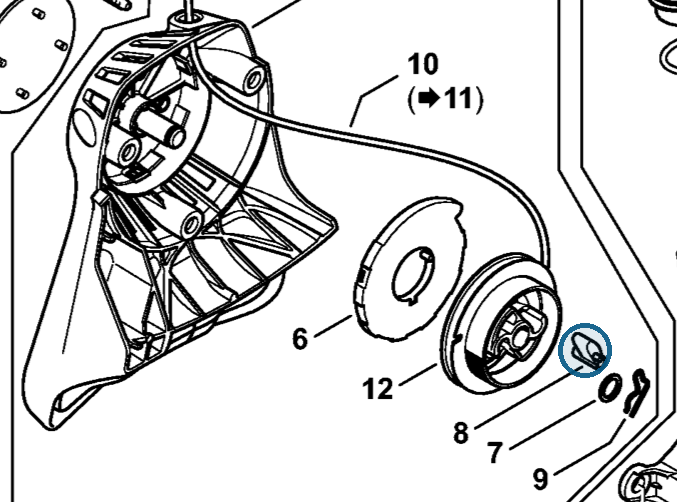
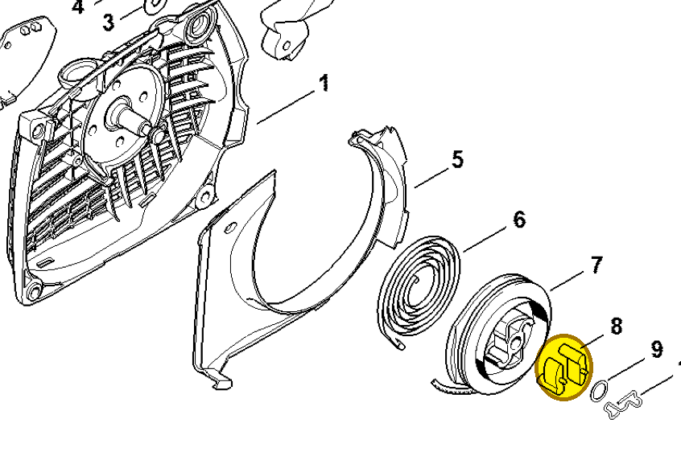
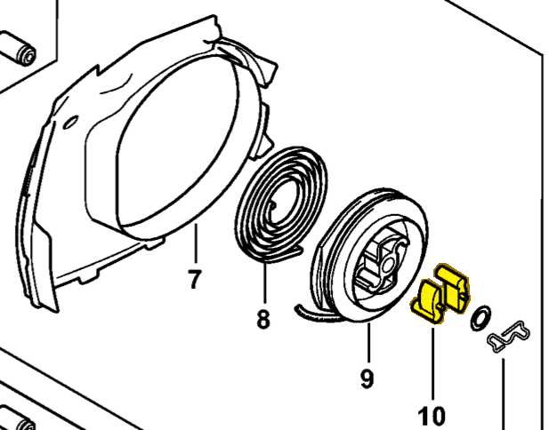

# Pawl

**0000 195 7200**

Bin **AA** · **5** per kit · **S2** supervision

[Part page](https://rduncangt.github.io/frk-management/parts/00001957200/) · [Field card PDF](field-card.pdf?raw=1) · [Avery label PDF](bag-label.pdf?raw=1) · [Offline reference](../../downloads/frk-part-reference.pdf?raw=1)

> **Fit unconfirmed. The inventory lists this number for HT 135, MS 261 and MS 462. The supplied manuals list different pawl numbers; interchangeability has not been verified.**

## HT 135 — rewind starter

Manual-listed pawl: 4116 195 7200. Shown in rewind starter [4182 190 4001](../41821904001/README.md).

**Item 8 · Qty listed: 1**

HT 135-Z spare-parts list, 10/28/2024. Drawing p. 5; parts table p. 6.

## MS 261 — rewind starter

Manual-listed pawl: 1125 195 7200. Shown in fan housing [1141 080 2104](../11410802104/README.md).

**Item 8 · Qty listed: 2**

MS 261 C-M spare-parts list, 10/02/2023. Drawing p. 19; parts table p. 20.

## MS 462 — rewind starter

Manual-listed pawl: 1125 195 7200. Shown in fan housing [1142 080 2102](../11420802102/README.md).

**Item 10 · Qty listed: 2**

MS 462 C-M Z spare-parts list, 10/29/2024. Drawing p. 21; parts table p. 22.

Drawings © ANDREAS STIHL AG & Co. KG. Not to scale.
