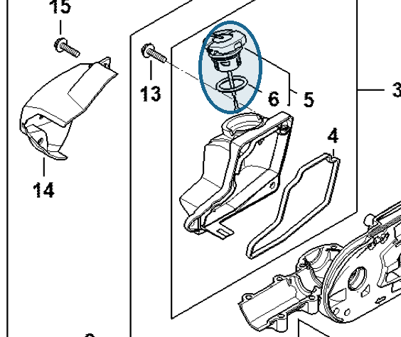

# Filler cap, oil

**0000 350 0529**

Bin **T7** · **1** per kit · **AS1** supervision

[Part page](https://rduncangt.github.io/frk-management/parts/00003500529/) · [Part reference sheet PDF](field-card.pdf?raw=1) · [Avery label PDF](bag-label.pdf?raw=1) · [Offline reference](../../downloads/frk-part-reference.pdf?raw=1)

## HT 135 — oil tank

Gear-head oil filler cap; includes seal (item 6).

**Item 5 · Qty listed: 1**

HT 135-Z spare-parts list, 10/28/2024. Drawing p. 17; parts table p. 18.

[Suggest a correction](https://github.com/rduncangt/frk-management/issues/new?title=Parts+correction%3A+0000+350+0529+%E2%80%94+Filler+cap%2C+oil&body=%2A%2APart%3A%2A%2A+Filler+cap%2C+oil%0A%2A%2APart+number%3A%2A%2A+0000+350+0529%0A%2A%2ASaw+model%28s%29%3A%2A%2A+HT+135%0A%2A%2APart+reference%3A%2A%2A+https%3A%2F%2Frduncangt.github.io%2Ffrk-management%2Fparts%2F00003500529%2F%0A%0A%2A%2AWhat+needs+changing%3A%2A%2A%0A%0A%0A%2A%2AReference+or+photo+%28if+available%29%3A%2A%2A%0A) · GitHub sign-in required.

Drawings © ANDREAS STIHL AG & Co. KG. Not to scale.
