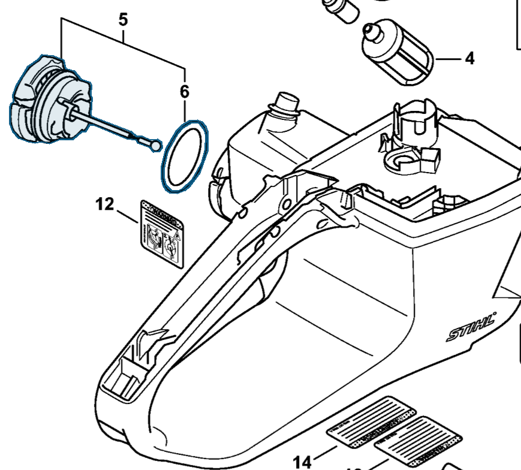
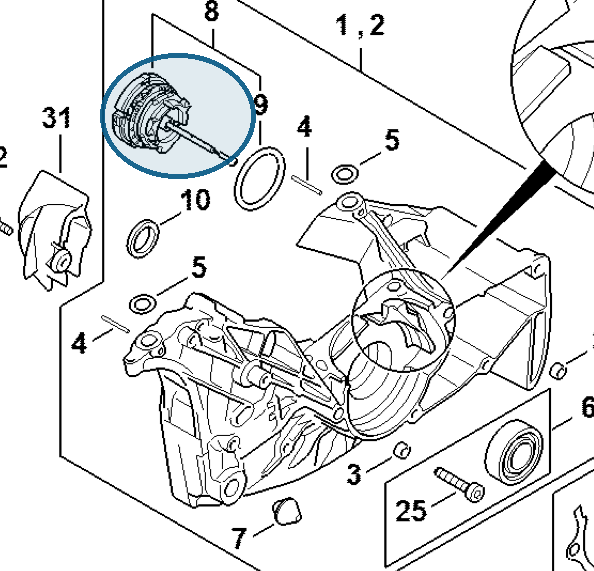

# Filler cap

**0000 350 0533**

Bin **O1** · **2** per kit · **AS1** supervision

[Part page](https://rduncangt.github.io/frk-management/parts/00003500533/) · [Part reference sheet PDF](field-card.pdf?raw=1) · [Avery label PDF](bag-label.pdf?raw=1) · [Offline reference](../../downloads/frk-part-reference.pdf?raw=1)

## MS 462 — fuel tank

Fuel filler cap; includes seal (item 6). The same part is used on the oil tank.

**Item 5 · Qty listed: 1**

MS 462 C-M Z spare-parts list, 10/29/2024. Drawing p. 23; parts table p. 24.

## MS 462 — oil tank

Oil filler cap in the crankcase; includes seal (item 9). Also listed in crankcase section B, table p. 7.

**Item 8 · Qty listed: 1**

MS 462 C-M Z spare-parts list, 10/29/2024. Drawing p. 3; parts table p. 4.

[Suggest a correction](https://github.com/rduncangt/frk-management/issues/new?title=Parts+correction%3A+0000+350+0533+%E2%80%94+Filler+cap&body=%2A%2APart%3A%2A%2A+Filler+cap%0A%2A%2APart+number%3A%2A%2A+0000+350+0533%0A%2A%2ASaw+model%28s%29%3A%2A%2A+MS+462%0A%2A%2APart+reference%3A%2A%2A+https%3A%2F%2Frduncangt.github.io%2Ffrk-management%2Fparts%2F00003500533%2F%0A%0A%2A%2AWhat+needs+changing%3A%2A%2A%0A%0A%0A%2A%2AReference+or+photo+%28if+available%29%3A%2A%2A%0A) · GitHub sign-in required.

Drawings © ANDREAS STIHL AG & Co. KG. Not to scale.
