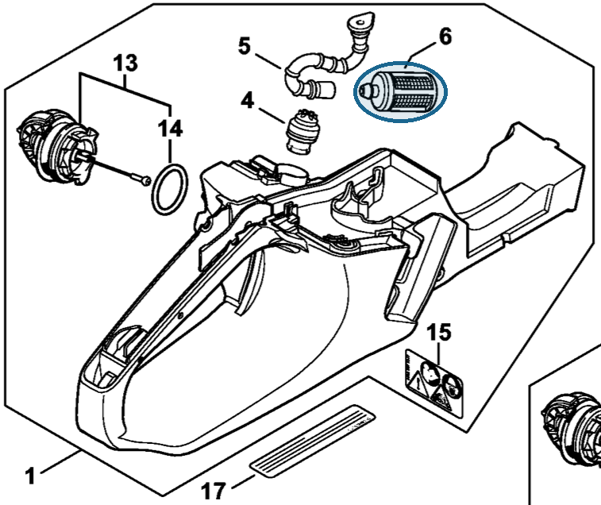
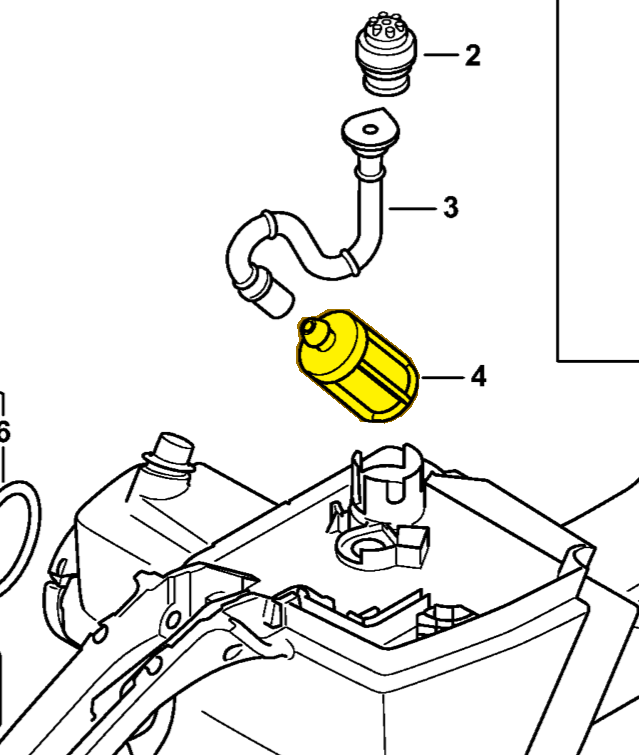

# Pickup body

**0000 350 3518**

Bin **T7** · **4** per kit · **S2** supervision

[Part page](https://rduncangt.github.io/frk-management/parts/00003503518/) · [Part reference sheet PDF](field-card.pdf?raw=1) · [Avery label PDF](bag-label.pdf?raw=1) · [Offline reference](../../downloads/frk-part-reference.pdf?raw=1)

## MS 261 — fuel tank

Fuel pickup body inside the tank, on fuel hose (item 5).

**Item 6 · Qty listed: 1**

MS 261 C-M spare-parts list, 10/02/2023. Drawing p. 21; parts table p. 22.

## MS 462 — fuel tank

Fuel pickup body inside the tank, on fuel hose (item 3).

**Item 4 · Qty listed: 1**

MS 462 C-M Z spare-parts list, 10/29/2024. Drawing p. 23; parts table p. 24.

[Suggest a correction](https://github.com/rduncangt/frk-management/issues/new?title=Parts+correction%3A+0000+350+3518+%E2%80%94+Pickup+body&body=%2A%2APart%3A%2A%2A+Pickup+body%0A%2A%2APart+number%3A%2A%2A+0000+350+3518%0A%2A%2ASaw+model%28s%29%3A%2A%2A+MS+261%2C+MS+462%0A%2A%2APart+reference%3A%2A%2A+https%3A%2F%2Frduncangt.github.io%2Ffrk-management%2Fparts%2F00003503518%2F%0A%0A%2A%2AWhat+needs+changing%3A%2A%2A%0A%0A%0A%2A%2AReference+or+photo+%28if+available%29%3A%2A%2A%0A) · GitHub sign-in required.

Drawings © ANDREAS STIHL AG & Co. KG. Not to scale.
