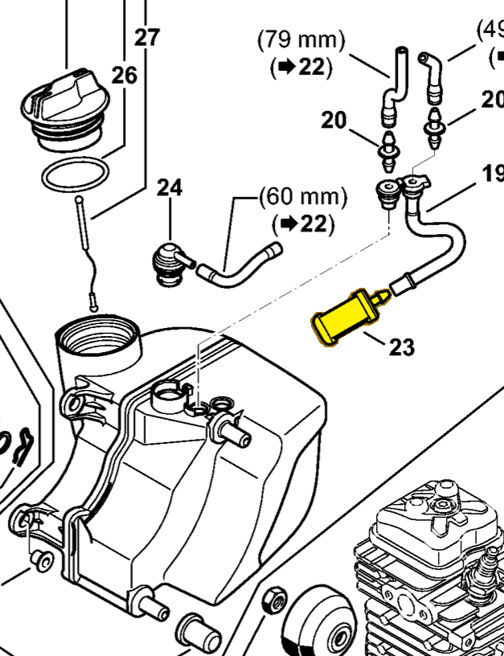

# Pickup body

**0000 350 3521**

Bin **B2** · **1** per kit · **S2** supervision

[Part page](https://rduncangt.github.io/frk-management/parts/00003503521/) · [Part reference sheet PDF](field-card.pdf?raw=1) · [Avery label PDF](bag-label.pdf?raw=1) · [Offline reference](../../downloads/frk-part-reference.pdf?raw=1)

## HT 135 — fuel tank

Fuel pickup body inside the tank, on the fuel hose.

**Item 23 · Qty listed: 1**

HT 135-Z spare-parts list, 10/28/2024. Drawing p. 5; parts table p. 6.

[Suggest a correction](https://github.com/rduncangt/frk-management/issues/new?title=Parts+correction%3A+0000+350+3521+%E2%80%94+Pickup+body&body=%2A%2APart%3A%2A%2A+Pickup+body%0A%2A%2APart+number%3A%2A%2A+0000+350+3521%0A%2A%2ASaw+model%28s%29%3A%2A%2A+HT+135%0A%2A%2APart+reference%3A%2A%2A+https%3A%2F%2Frduncangt.github.io%2Ffrk-management%2Fparts%2F00003503521%2F%0A%0A%2A%2AWhat+needs+changing%3A%2A%2A%0A%0A%0A%2A%2AReference+or+photo+%28if+available%29%3A%2A%2A%0A) · GitHub sign-in required.

Drawings © ANDREAS STIHL AG & Co. KG. Not to scale.
