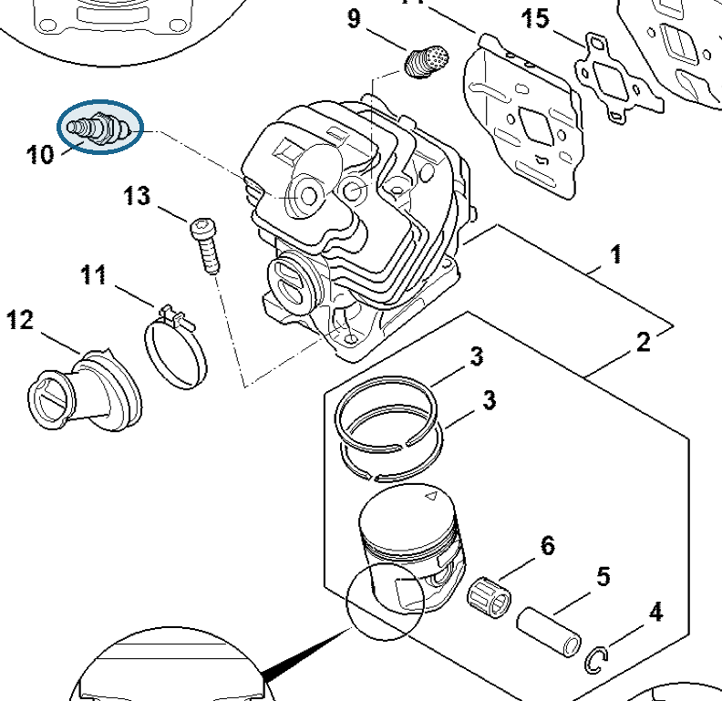
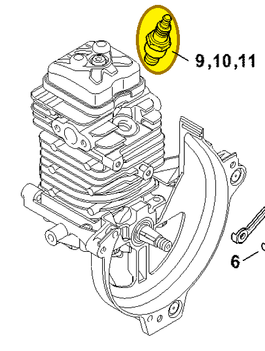

# Spark plug NGK CMR6H

**0000 400 7011**

Bin **D4** · **2** per kit · **S1** supervision

[Part page](https://rduncangt.github.io/frk-management/parts/00004007011/) · [Part reference sheet PDF](field-card.pdf?raw=1) · [Avery label PDF](bag-label.pdf?raw=1) · [Offline reference](../../downloads/frk-part-reference.pdf?raw=1)

## MS 462 — cylinder

Spark plug in the cylinder. Also listed in section D and the ignition-system section.

**Item 10 · Qty listed: 1**

MS 462 C-M Z spare-parts list, 10/29/2024. Drawing p. 9; parts table p. 10.

## HT 135 — cylinder

Spark plug in the cylinder.

**Item 9 · Qty listed: 1**

HT 135-Z spare-parts list, 10/28/2024. Drawing p. 8; parts table p. 9.

[Suggest a correction](https://github.com/rduncangt/frk-management/issues/new?title=Parts+correction%3A+0000+400+7011+%E2%80%94+Spark+plug+NGK+CMR6H&body=%2A%2APart%3A%2A%2A+Spark+plug+NGK+CMR6H%0A%2A%2APart+number%3A%2A%2A+0000+400+7011%0A%2A%2ASaw+model%28s%29%3A%2A%2A+HT+135%2C+MS+462%0A%2A%2APart+reference%3A%2A%2A+https%3A%2F%2Frduncangt.github.io%2Ffrk-management%2Fparts%2F00004007011%2F%0A%0A%2A%2AWhat+needs+changing%3A%2A%2A%0A%0A%0A%2A%2AReference+or+photo+%28if+available%29%3A%2A%2A%0A) · GitHub sign-in required.

Drawings © ANDREAS STIHL AG & Co. KG. Not to scale.
