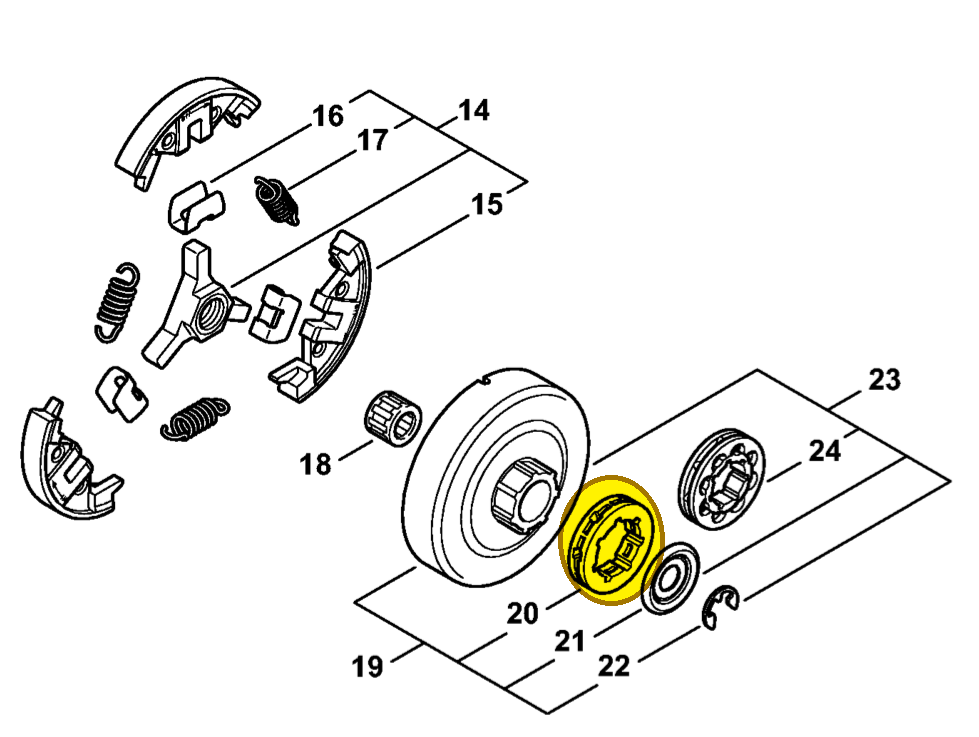

# Rim sprocket 3/8" 7T

**0000 642 1223**

Bin **T2** · **1** per kit · **AS1** supervision

[Part page](https://rduncangt.github.io/frk-management/parts/00006421223/) · [Part reference sheet PDF](field-card.pdf?raw=1) · [Avery label PDF](bag-label.pdf?raw=1) · [Offline reference](../../downloads/frk-part-reference.pdf?raw=1)

## MS 462 — rim sprocket

3/8-inch pitch; 7 teeth. The FRK also contains the separate 8-tooth kit [1128 007 1001](../11280071001/README.md).

**Item 20 · Qty listed: 1**

MS 462 C-M Z spare-parts list, 10/29/2024. Drawing p. 13; parts table p. 14.

[Suggest a correction](https://github.com/rduncangt/frk-management/issues/new?title=Parts+correction%3A+0000+642+1223+%E2%80%94+Rim+sprocket+3%2F8%22+7T&body=%2A%2APart%3A%2A%2A+Rim+sprocket+3%2F8%22+7T%0A%2A%2APart+number%3A%2A%2A+0000+642+1223%0A%2A%2ASaw+model%28s%29%3A%2A%2A+MS+462%0A%2A%2APart+reference%3A%2A%2A+https%3A%2F%2Frduncangt.github.io%2Ffrk-management%2Fparts%2F00006421223%2F%0A%0A%2A%2AWhat+needs+changing%3A%2A%2A%0A%0A%0A%2A%2AReference+or+photo+%28if+available%29%3A%2A%2A%0A) · GitHub sign-in required.

Drawings © ANDREAS STIHL AG & Co. KG. Not to scale.
