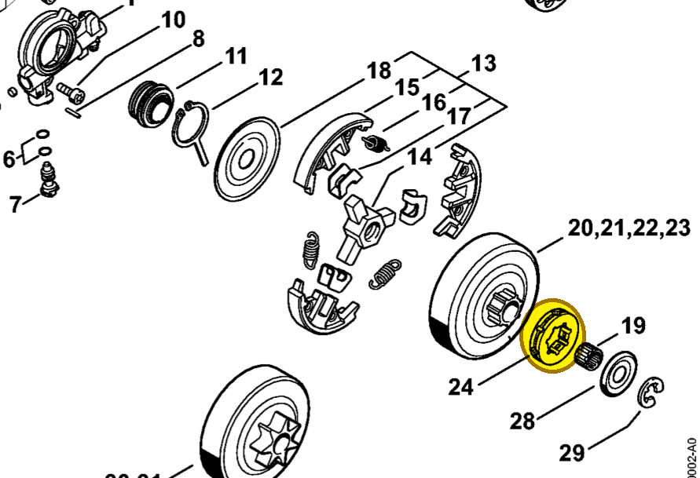

# Rim sprocket 0.325" 7T

**0000 642 1236**

Bin **A3** · **2** per kit · **AS1** supervision

[Part page](https://rduncangt.github.io/frk-management/parts/00006421236/) · [Part reference sheet PDF](field-card.pdf?raw=1) · [Avery label PDF](bag-label.pdf?raw=1) · [Offline reference](../../downloads/frk-part-reference.pdf?raw=1)

## MS 261 — rim sprocket

0.325-inch pitch; 7 teeth. Included in rim sprocket kit [1141 007 1002](../11410071002/README.md).

**Item 24 · Qty listed: 1**

MS 261 C-M spare-parts list, 10/02/2023. Drawing p. 10; parts table p. 11.

[Suggest a correction](https://github.com/rduncangt/frk-management/issues/new?title=Parts+correction%3A+0000+642+1236+%E2%80%94+Rim+sprocket+0.325%22+7T&body=%2A%2APart%3A%2A%2A+Rim+sprocket+0.325%22+7T%0A%2A%2APart+number%3A%2A%2A+0000+642+1236%0A%2A%2ASaw+model%28s%29%3A%2A%2A+MS+261%0A%2A%2APart+reference%3A%2A%2A+https%3A%2F%2Frduncangt.github.io%2Ffrk-management%2Fparts%2F00006421236%2F%0A%0A%2A%2AWhat+needs+changing%3A%2A%2A%0A%0A%0A%2A%2AReference+or+photo+%28if+available%29%3A%2A%2A%0A) · GitHub sign-in required.

Drawings © ANDREAS STIHL AG & Co. KG. Not to scale.
