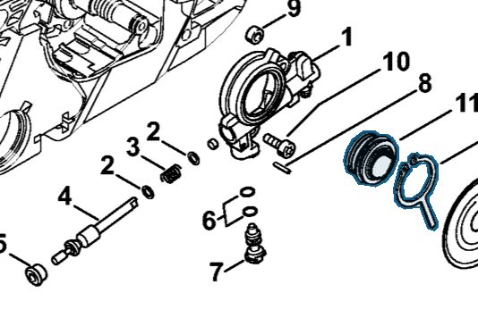

# Worm

**1121 640 7111**

Bin **B3** · **3** per kit · **S2** supervision

[Part page](https://rduncangt.github.io/frk-management/parts/11216407111/) · [Part reference sheet PDF](field-card.pdf?raw=1) · [Avery label PDF](bag-label.pdf?raw=1) · [Offline reference](../../downloads/frk-part-reference.pdf?raw=1)

## MS 261 — oil pump drive

Includes carrier [1121 647 3100](../11216473100/README.md) (item 12). Drives oil pump [1141 640 3200](../11416403200/README.md).

**Item 11 · Qty listed: 1**

MS 261 C-M spare-parts list, 10/02/2023. Drawing p. 10; parts table p. 11.

[Suggest a correction](https://github.com/rduncangt/frk-management/issues/new?title=Parts+correction%3A+1121+640+7111+%E2%80%94+Worm&body=%2A%2APart%3A%2A%2A+Worm%0A%2A%2APart+number%3A%2A%2A+1121+640+7111%0A%2A%2ASaw+model%28s%29%3A%2A%2A+MS+261%0A%2A%2APart+reference%3A%2A%2A+https%3A%2F%2Frduncangt.github.io%2Ffrk-management%2Fparts%2F11216407111%2F%0A%0A%2A%2AWhat+needs+changing%3A%2A%2A%0A%0A%0A%2A%2AReference+or+photo+%28if+available%29%3A%2A%2A%0A) · GitHub sign-in required.

Drawings © ANDREAS STIHL AG & Co. KG. Not to scale.
