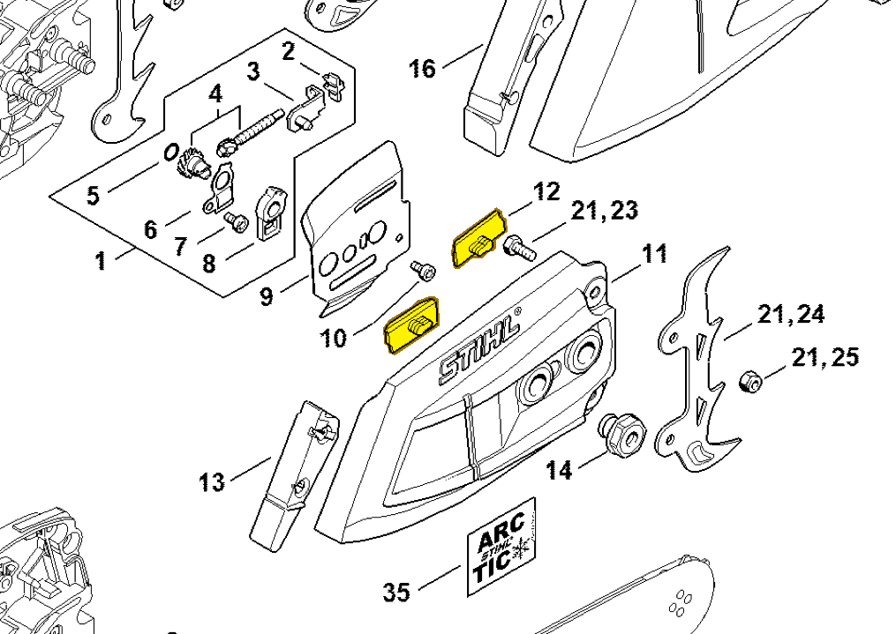
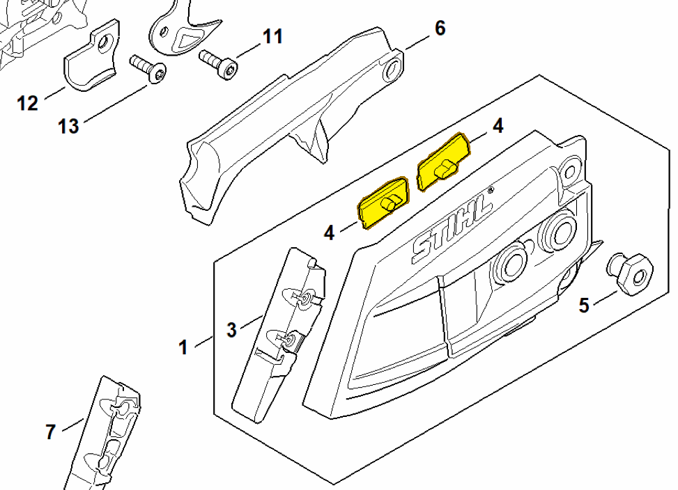

# Bumper strip

**1121 648 6610**

Bin **T9** · **8** per kit · **S1** supervision

[Part page](https://rduncangt.github.io/frk-management/parts/11216486610/) · [Part reference sheet PDF](field-card.pdf?raw=1) · [Avery label PDF](bag-label.pdf?raw=1) · [Offline reference](../../downloads/frk-part-reference.pdf?raw=1)

## MS 261 — chain sprocket cover

Two strips on the inside of the chain sprocket cover.

**Item 12 · Qty listed: 2**

MS 261 C-M spare-parts list, 10/02/2023. Drawing p. 15; parts table p. 16.

## MS 462 — chain sprocket cover

Two strips on the inside of the chain sprocket cover.

**Item 4 · Qty listed: 2**

MS 462 C-M Z spare-parts list, 10/29/2024. Drawing p. 17; parts table p. 18.

[Suggest a correction](https://github.com/rduncangt/frk-management/issues/new?title=Parts+correction%3A+1121+648+6610+%E2%80%94+Bumper+strip&body=%2A%2APart%3A%2A%2A+Bumper+strip%0A%2A%2APart+number%3A%2A%2A+1121+648+6610%0A%2A%2ASaw+model%28s%29%3A%2A%2A+MS+261%2C+MS+462%0A%2A%2APart+reference%3A%2A%2A+https%3A%2F%2Frduncangt.github.io%2Ffrk-management%2Fparts%2F11216486610%2F%0A%0A%2A%2AWhat+needs+changing%3A%2A%2A%0A%0A%0A%2A%2AReference+or+photo+%28if+available%29%3A%2A%2A%0A) · GitHub sign-in required.

Drawings © ANDREAS STIHL AG & Co. KG. Not to scale.
