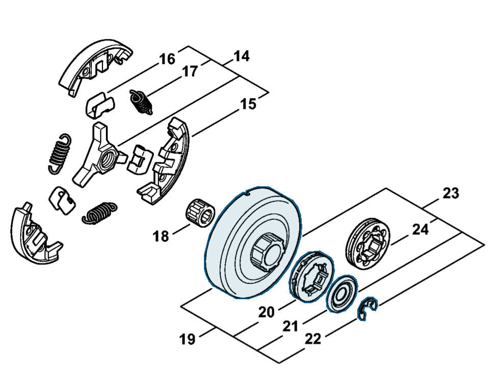

# Rim sprocket kit 3/8" 7T

**1128 007 1000**

Bin **B5** · **1** per kit · **AS1** supervision

[Part page](https://rduncangt.github.io/frk-management/parts/11280071000/) · [Part reference sheet PDF](field-card.pdf?raw=1) · [Avery label PDF](bag-label.pdf?raw=1) · [Offline reference](../../downloads/frk-part-reference.pdf?raw=1)

## MS 462 — rim sprocket kit

3/8-inch pitch; 7 teeth. Includes rim sprocket [0000 642 1223](../00006421223/README.md) (item 20), washer [0000 958 1032](../00009581032/README.md) (item 21) and E-clip [9460 624 0801](../94606240801/README.md#ms462-clutch-drum) (item 22).

**Item 19 · Qty listed: 1**

MS 462 C-M Z spare-parts list, 10/29/2024. Drawing p. 13; parts table p. 14.

[Suggest a correction](https://github.com/rduncangt/frk-management/issues/new?title=Parts+correction%3A+1128+007+1000+%E2%80%94+Rim+sprocket+kit+3%2F8%22+7T&body=%2A%2APart%3A%2A%2A+Rim+sprocket+kit+3%2F8%22+7T%0A%2A%2APart+number%3A%2A%2A+1128+007+1000%0A%2A%2ASaw+model%28s%29%3A%2A%2A+MS+462%0A%2A%2APart+reference%3A%2A%2A+https%3A%2F%2Frduncangt.github.io%2Ffrk-management%2Fparts%2F11280071000%2F%0A%0A%2A%2AWhat+needs+changing%3A%2A%2A%0A%0A%0A%2A%2AReference+or+photo+%28if+available%29%3A%2A%2A%0A) · GitHub sign-in required.

Drawings © ANDREAS STIHL AG & Co. KG. Not to scale.
