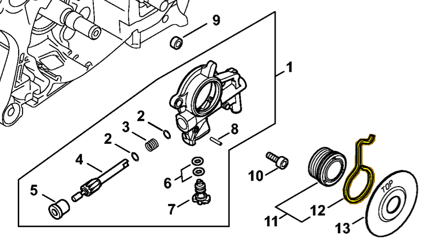

# Spring

**1128 647 2400**

Bin **D3** · **1** per kit · **S2** supervision

[Part page](https://rduncangt.github.io/frk-management/parts/11286472400/) · [Part reference sheet PDF](field-card.pdf?raw=1) · [Avery label PDF](bag-label.pdf?raw=1) · [Offline reference](../../downloads/frk-part-reference.pdf?raw=1)

## MS 462 — oil pump drive

Spring on worm [1128 640 7112](../11286407112/README.md) (item 11).

**Item 12 · Qty listed: 1**

MS 462 C-M Z spare-parts list, 10/29/2024. Drawing p. 13; parts table p. 14.

[Suggest a correction](https://github.com/rduncangt/frk-management/issues/new?title=Parts+correction%3A+1128+647+2400+%E2%80%94+Spring&body=%2A%2APart%3A%2A%2A+Spring%0A%2A%2APart+number%3A%2A%2A+1128+647+2400%0A%2A%2ASaw+model%28s%29%3A%2A%2A+MS+462%0A%2A%2APart+reference%3A%2A%2A+https%3A%2F%2Frduncangt.github.io%2Ffrk-management%2Fparts%2F11286472400%2F%0A%0A%2A%2AWhat+needs+changing%3A%2A%2A%0A%0A%0A%2A%2AReference+or+photo+%28if+available%29%3A%2A%2A%0A) · GitHub sign-in required.

Drawings © ANDREAS STIHL AG & Co. KG. Not to scale.
