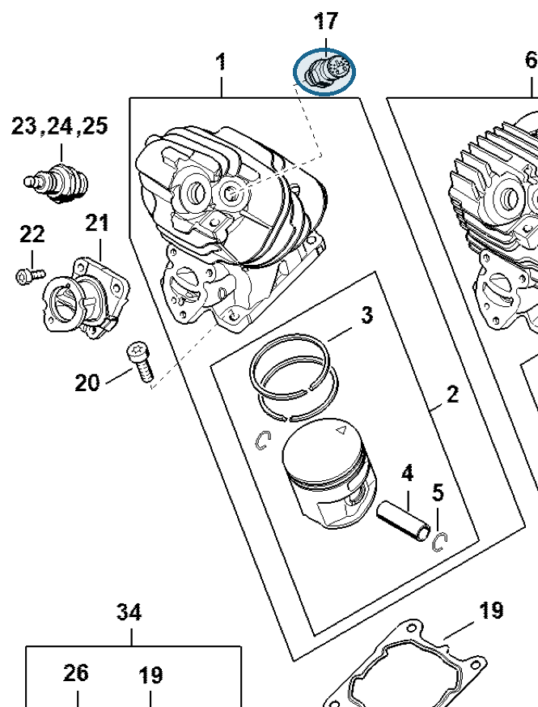

# Decompression valve

**1141 020 9430**

Bin **T4** · **1** per kit · **S2** supervision

[Part page](https://rduncangt.github.io/frk-management/parts/11410209430/) · [Part reference sheet PDF](field-card.pdf?raw=1) · [Avery label PDF](bag-label.pdf?raw=1) · [Offline reference](../../downloads/frk-part-reference.pdf?raw=1)

## MS 261 — cylinder

Decompression valve in the cylinder.

**Item 17 · Qty listed: 1**

MS 261 C-M spare-parts list, 10/02/2023. Drawing p. 8; parts table p. 9.

[Suggest a correction](https://github.com/rduncangt/frk-management/issues/new?title=Parts+correction%3A+1141+020+9430+%E2%80%94+Decompression+valve&body=%2A%2APart%3A%2A%2A+Decompression+valve%0A%2A%2APart+number%3A%2A%2A+1141+020+9430%0A%2A%2ASaw+model%28s%29%3A%2A%2A+MS+261%0A%2A%2APart+reference%3A%2A%2A+https%3A%2F%2Frduncangt.github.io%2Ffrk-management%2Fparts%2F11410209430%2F%0A%0A%2A%2AWhat+needs+changing%3A%2A%2A%0A%0A%0A%2A%2AReference+or+photo+%28if+available%29%3A%2A%2A%0A) · GitHub sign-in required.

Drawings © ANDREAS STIHL AG & Co. KG. Not to scale.
