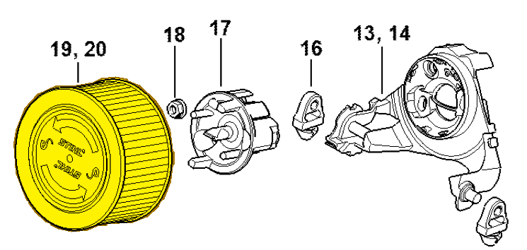

# Air filter HD2

**1141 140 4400**

Bin **O1** · **1** per kit · **S1** supervision

[Part page](https://rduncangt.github.io/frk-management/parts/11411404400/) · [Field card PDF](field-card.pdf?raw=1) · [Avery label PDF](bag-label.pdf?raw=1) · [Offline reference](../../downloads/frk-part-reference.pdf?raw=1)

## MS 261 — air filter

HD2 air filter on the carburetor bracket.

**Item 19 · Qty listed: 1**

MS 261 C-M spare-parts list, 10/02/2023. Drawing p. 27; parts table p. 28.

Drawings © ANDREAS STIHL AG & Co. KG. Not to scale.
