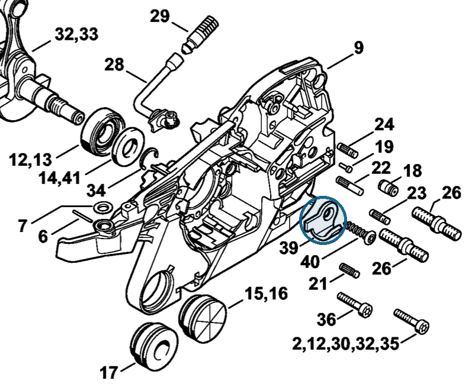

# Chain catcher

**1141 656 7700**

Bin **T11** · **3** per kit · **AS1** supervision

[Part page](https://rduncangt.github.io/frk-management/parts/11416567700/) · [Part reference sheet PDF](field-card.pdf?raw=1) · [Avery label PDF](bag-label.pdf?raw=1) · [Offline reference](../../downloads/frk-part-reference.pdf?raw=1)

## MS 261 — chain catcher

Secured to the crankcase by self-tapping screw [9074 477 4438](../90744774438/README.md) (IS-P6×30; item 40).

**Item 39 · Qty listed: 1**

MS 261 C-M spare-parts list, 10/02/2023. Drawing p. 3; parts table p. 5.

[Suggest a correction](https://github.com/rduncangt/frk-management/issues/new?title=Parts+correction%3A+1141+656+7700+%E2%80%94+Chain+catcher&body=%2A%2APart%3A%2A%2A+Chain+catcher%0A%2A%2APart+number%3A%2A%2A+1141+656+7700%0A%2A%2ASaw+model%28s%29%3A%2A%2A+MS+261%0A%2A%2APart+reference%3A%2A%2A+https%3A%2F%2Frduncangt.github.io%2Ffrk-management%2Fparts%2F11416567700%2F%0A%0A%2A%2AWhat+needs+changing%3A%2A%2A%0A%0A%0A%2A%2AReference+or+photo+%28if+available%29%3A%2A%2A%0A) · GitHub sign-in required.

Drawings © ANDREAS STIHL AG & Co. KG. Not to scale.
