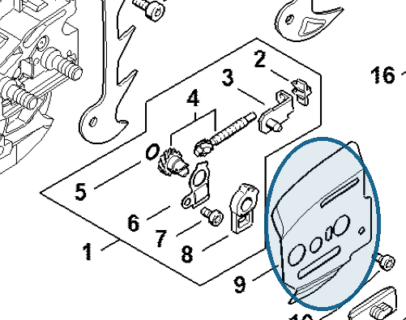

# Inner side plate

**1141 664 1030**

Bin **D1** · **2** per kit · **S2** supervision

[Part page](https://rduncangt.github.io/frk-management/parts/11416641030/) · [Field card PDF](field-card.pdf?raw=1) · [Avery label PDF](bag-label.pdf?raw=1) · [Offline reference](../../downloads/frk-part-reference.pdf?raw=1)

## MS 261 — guide bar

Inner side plate between the crankcase and guide bar.

**Item 9 · Qty listed: 1**

MS 261 C-M spare-parts list, 10/02/2023. Drawing p. 15; parts table p. 16.

Drawings © ANDREAS STIHL AG & Co. KG. Not to scale.
