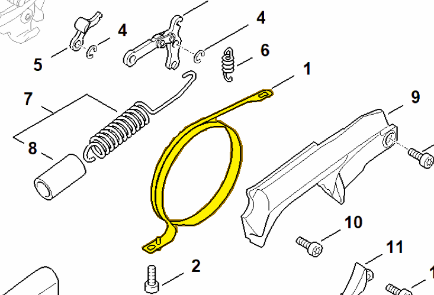

# Brake band

**1142 160 5400**

Bin **B2** · **1** per kit · **S2** supervision

[Part page](https://rduncangt.github.io/frk-management/parts/11421605400/) · [Part reference sheet PDF](field-card.pdf?raw=1) · [Avery label PDF](bag-label.pdf?raw=1) · [Offline reference](../../downloads/frk-part-reference.pdf?raw=1)

## MS 462 — chain brake

Brake band around the clutch drum. Shown with tension spring [1142 160 5500](../11421605500/README.md).

**Item 1 · Qty listed: 1**

MS 462 C-M Z spare-parts list, 10/29/2024. Drawing p. 15; parts table p. 16.

[Suggest a correction](https://github.com/rduncangt/frk-management/issues/new?title=Parts+correction%3A+1142+160+5400+%E2%80%94+Brake+band&body=%2A%2APart%3A%2A%2A+Brake+band%0A%2A%2APart+number%3A%2A%2A+1142+160+5400%0A%2A%2ASaw+model%28s%29%3A%2A%2A+MS+462%0A%2A%2APart+reference%3A%2A%2A+https%3A%2F%2Frduncangt.github.io%2Ffrk-management%2Fparts%2F11421605400%2F%0A%0A%2A%2AWhat+needs+changing%3A%2A%2A%0A%0A%0A%2A%2AReference+or+photo+%28if+available%29%3A%2A%2A%0A) · GitHub sign-in required.

Drawings © ANDREAS STIHL AG & Co. KG. Not to scale.
