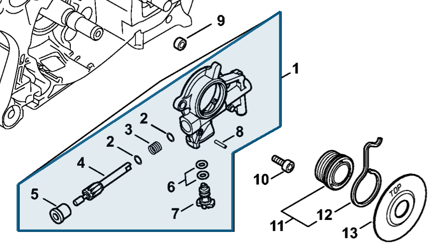

# Oil pump

**1142 640 3200**

Bin **D3** · **1** per kit · **S2** supervision

[Part page](https://rduncangt.github.io/frk-management/parts/11426403200/) · [Field card PDF](field-card.pdf?raw=1) · [Avery label PDF](bag-label.pdf?raw=1) · [Offline reference](../../downloads/frk-part-reference.pdf?raw=1)

## MS 462 — oil pump

Assembly includes items 2–8. Driven by worm [1128 640 7112](../11286407112/README.md).

**Item 1 · Qty listed: 1**

MS 462 C-M Z spare-parts list, 10/29/2024. Drawing p. 13; parts table p. 14.

Drawings © ANDREAS STIHL AG & Co. KG. Not to scale.
