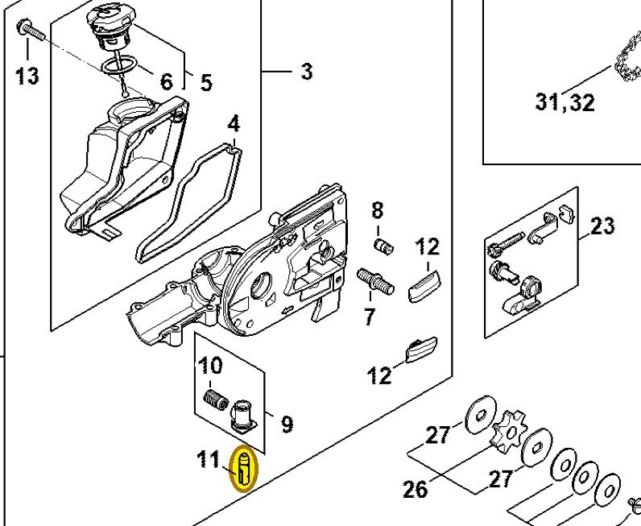

# Oil pump

**4138 640 3200**

Bin **D3** · **1** per kit · **S2** supervision

[Part page](https://rduncangt.github.io/frk-management/parts/41386403200/) · [Part reference sheet PDF](field-card.pdf?raw=1) · [Avery label PDF](bag-label.pdf?raw=1) · [Offline reference](../../downloads/frk-part-reference.pdf?raw=1)

## HT 135 — oil pump

Oil pump in the gear-head housing.

**Item 11 · Qty listed: 1**

HT 135-Z spare-parts list, 10/28/2024. Drawing p. 17; parts table p. 18.

[Suggest a correction](https://github.com/rduncangt/frk-management/issues/new?title=Parts+correction%3A+4138+640+3200+%E2%80%94+Oil+pump&body=%2A%2APart%3A%2A%2A+Oil+pump%0A%2A%2APart+number%3A%2A%2A+4138+640+3200%0A%2A%2ASaw+model%28s%29%3A%2A%2A+HT+135%0A%2A%2APart+reference%3A%2A%2A+https%3A%2F%2Frduncangt.github.io%2Ffrk-management%2Fparts%2F41386403200%2F%0A%0A%2A%2AWhat+needs+changing%3A%2A%2A%0A%0A%0A%2A%2AReference+or+photo+%28if+available%29%3A%2A%2A%0A) · GitHub sign-in required.

Drawings © ANDREAS STIHL AG & Co. KG. Not to scale.
