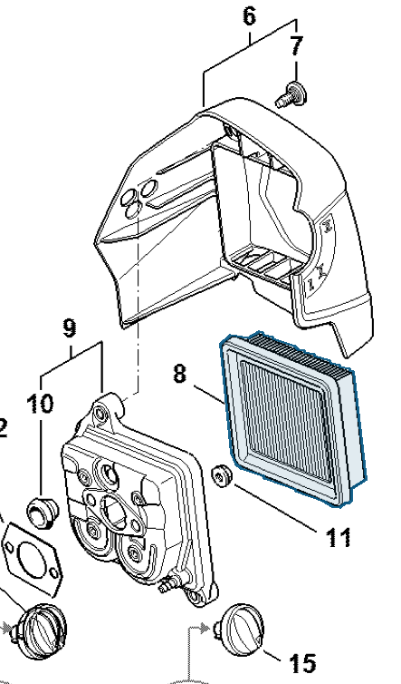

# Air filter

**4180 141 0300**

Bin **T7** · **1** per kit · **S1** supervision

[Part page](https://rduncangt.github.io/frk-management/parts/41801410300/) · [Part reference sheet PDF](field-card.pdf?raw=1) · [Avery label PDF](bag-label.pdf?raw=1) · [Offline reference](../../downloads/frk-part-reference.pdf?raw=1)

## HT 135 — air filter

Air-filter element between the filter cover (item 6) and filter housing (item 9).

**Item 8 · Qty listed: 1**

HT 135-Z spare-parts list, 10/28/2024. Drawing p. 20; parts table p. 21.

[Suggest a correction](https://github.com/rduncangt/frk-management/issues/new?title=Parts+correction%3A+4180+141+0300+%E2%80%94+Air+filter&body=%2A%2APart%3A%2A%2A+Air+filter%0A%2A%2APart+number%3A%2A%2A+4180+141+0300%0A%2A%2ASaw+model%28s%29%3A%2A%2A+HT+135%0A%2A%2APart+reference%3A%2A%2A+https%3A%2F%2Frduncangt.github.io%2Ffrk-management%2Fparts%2F41801410300%2F%0A%0A%2A%2AWhat+needs+changing%3A%2A%2A%0A%0A%0A%2A%2AReference+or+photo+%28if+available%29%3A%2A%2A%0A) · GitHub sign-in required.

Drawings © ANDREAS STIHL AG & Co. KG. Not to scale.
