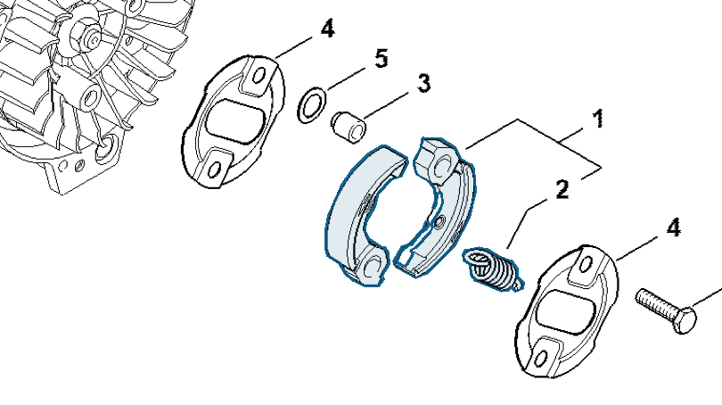

# Clutch

**4180 160 2000**

Bin **D2** · **1** per kit · **S2** supervision

[Part page](https://rduncangt.github.io/frk-management/parts/41801602000/) · [Field card PDF](field-card.pdf?raw=1) · [Avery label PDF](bag-label.pdf?raw=1) · [Offline reference](../../downloads/frk-part-reference.pdf?raw=1)

## HT 135 — clutch

Clutch on the crankshaft; includes spring (item 2).

**Item 1 · Qty listed: 1**

HT 135-Z spare-parts list, 10/28/2024. Drawing p. 13; parts table p. 14.

Drawings © ANDREAS STIHL AG & Co. KG. Not to scale.
