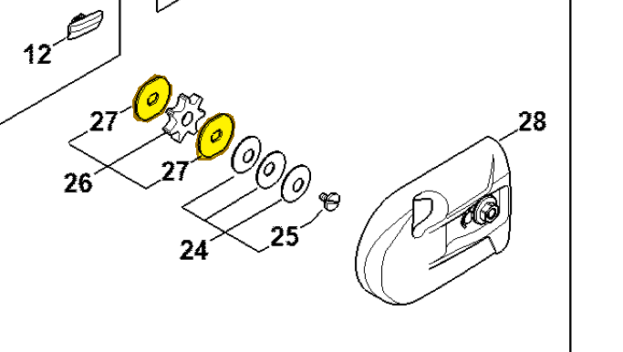

# Washer

**4182 162 8900**

Bin **A3** · **2** per kit · **S2** supervision

[Part page](https://rduncangt.github.io/frk-management/parts/41821628900/) · [Part reference sheet PDF](field-card.pdf?raw=1) · [Avery label PDF](bag-label.pdf?raw=1) · [Offline reference](../../downloads/frk-part-reference.pdf?raw=1)

## HT 135 — gear head

Washers on either side of chain sprocket [0000 640 2003](../00006402003/README.md) (item 26).

**Item 27 · Qty listed: 2**

HT 135-Z spare-parts list, 10/28/2024. Drawing p. 17; parts table p. 18.

[Suggest a correction](https://github.com/rduncangt/frk-management/issues/new?title=Parts+correction%3A+4182+162+8900+%E2%80%94+Washer&body=%2A%2APart%3A%2A%2A+Washer%0A%2A%2APart+number%3A%2A%2A+4182+162+8900%0A%2A%2ASaw+model%28s%29%3A%2A%2A+HT+135%0A%2A%2APart+reference%3A%2A%2A+https%3A%2F%2Frduncangt.github.io%2Ffrk-management%2Fparts%2F41821628900%2F%0A%0A%2A%2AWhat+needs+changing%3A%2A%2A%0A%0A%0A%2A%2AReference+or+photo+%28if+available%29%3A%2A%2A%0A) · GitHub sign-in required.

Drawings © ANDREAS STIHL AG & Co. KG. Not to scale.
