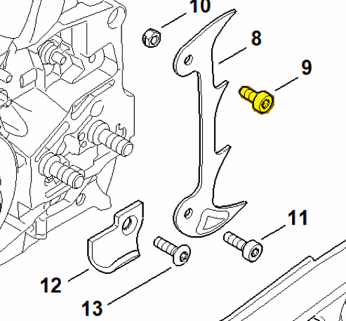
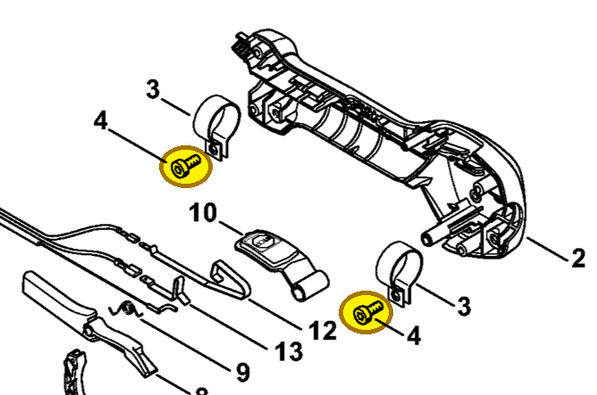

# Spline screw M5x12

**9022 341 0960**

Bin **A9** · **1** per kit · **S2** supervision

[Part page](https://rduncangt.github.io/frk-management/parts/90223410960/) · [Field card PDF](field-card.pdf?raw=1) · [Avery label PDF](bag-label.pdf?raw=1) · [Offline reference](../../downloads/frk-part-reference.pdf?raw=1)

## MS 462 — bumper spike

IS-M5×12. Screw at the upper hole of the inner bumper spike (item 8).

**Item 9 · Qty listed: 1**

MS 462 C-M Z spare-parts list, 10/29/2024. Drawing p. 17; parts table p. 18.

## HT 135 — handle clamps

IS-M5×12. Two screws secure the clamps (item 3) inside the control handle.

**Item 4 · Qty listed: 2**

HT 135-Z spare-parts list, 10/28/2024. Drawing p. 15; parts table p. 16.

Drawings © ANDREAS STIHL AG & Co. KG. Not to scale.
