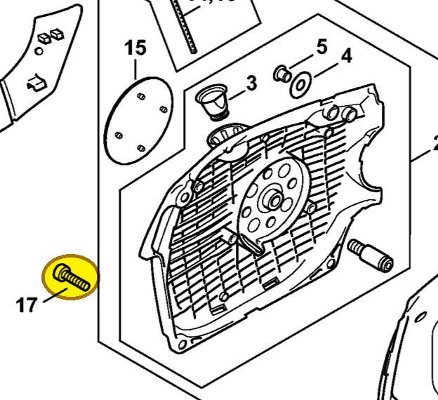
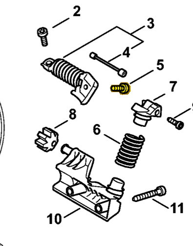
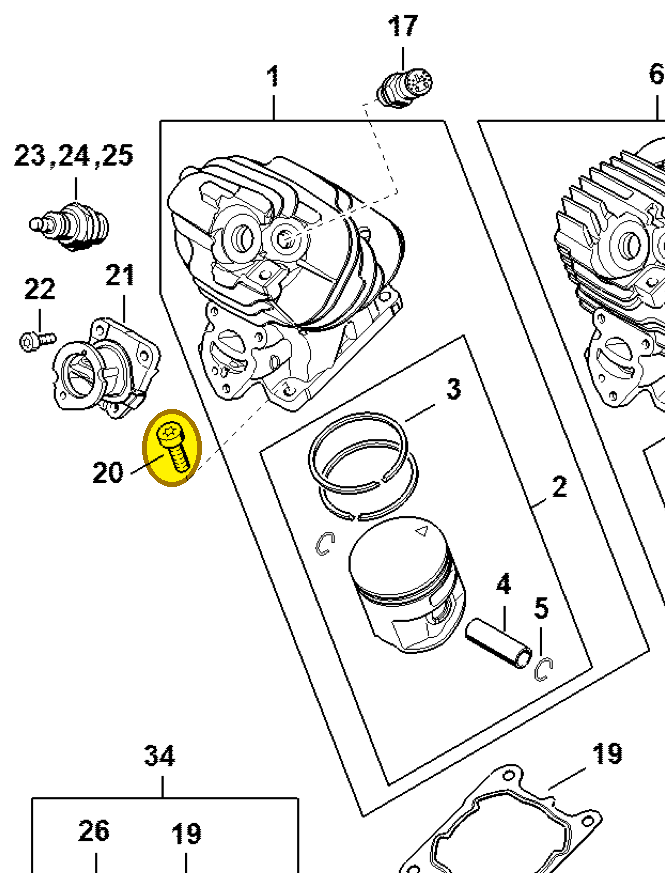

# Pan head screw IS M5x20

**9022 371 1020**

Bin **A9** · **1** per kit · **S2** supervision

[Part page](https://rduncangt.github.io/frk-management/parts/90223711020/) · [Field card PDF](field-card.pdf?raw=1) · [Avery label PDF](bag-label.pdf?raw=1) · [Offline reference](../../downloads/frk-part-reference.pdf?raw=1)

## MS 462 — starter housing

IS M5×20. Secures fan housing [1142 080 2102](../11420802102/README.md) to the crankcase.

**Item 17 · Qty listed: 3**

MS 462 C-M Z spare-parts list, 10/29/2024. Drawing p. 21; parts table p. 22.

## MS 462 — AV system

IS M5×20. Fastening in the anti-vibration assembly.

**Item 5 · Qty listed: 1**

MS 462 C-M Z spare-parts list, 10/29/2024. Drawing p. 32; parts table p. 33.

## MS 261 — cylinder

IS M5×20. Cylinder-to-crankcase fastening.

**Item 20 · Qty listed: 4**

MS 261 C-M spare-parts list, 10/02/2023. Drawing p. 8; parts table p. 9.

Drawings © ANDREAS STIHL AG & Co. KG. Not to scale.
