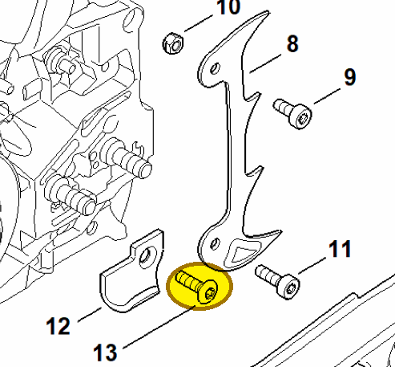

# Countersunk screw M5x18-10.9

**9061 373 0982**

Bin **T12** · **2** per kit · **AS1** supervision

[Part page](https://rduncangt.github.io/frk-management/parts/90613730982/) · [Part reference sheet PDF](field-card.pdf?raw=1) · [Avery label PDF](bag-label.pdf?raw=1) · [Offline reference](../../downloads/frk-part-reference.pdf?raw=1)

## MS 462 — chain catcher

Secures chain catcher [1142 656 7700](../11426567700/README.md) (item 12) to the crankcase.

**Item 13 · Qty listed: 1**

MS 462 C-M Z spare-parts list, 10/29/2024. Drawing p. 17; parts table p. 18.

[Suggest a correction](https://github.com/rduncangt/frk-management/issues/new?title=Parts+correction%3A+9061+373+0982+%E2%80%94+Countersunk+screw+M5x18-10.9&body=%2A%2APart%3A%2A%2A+Countersunk+screw+M5x18-10.9%0A%2A%2APart+number%3A%2A%2A+9061+373+0982%0A%2A%2ASaw+model%28s%29%3A%2A%2A+MS+462%0A%2A%2APart+reference%3A%2A%2A+https%3A%2F%2Frduncangt.github.io%2Ffrk-management%2Fparts%2F90613730982%2F%0A%0A%2A%2AWhat+needs+changing%3A%2A%2A%0A%0A%0A%2A%2AReference+or+photo+%28if+available%29%3A%2A%2A%0A) · GitHub sign-in required.

Drawings © ANDREAS STIHL AG & Co. KG. Not to scale.
