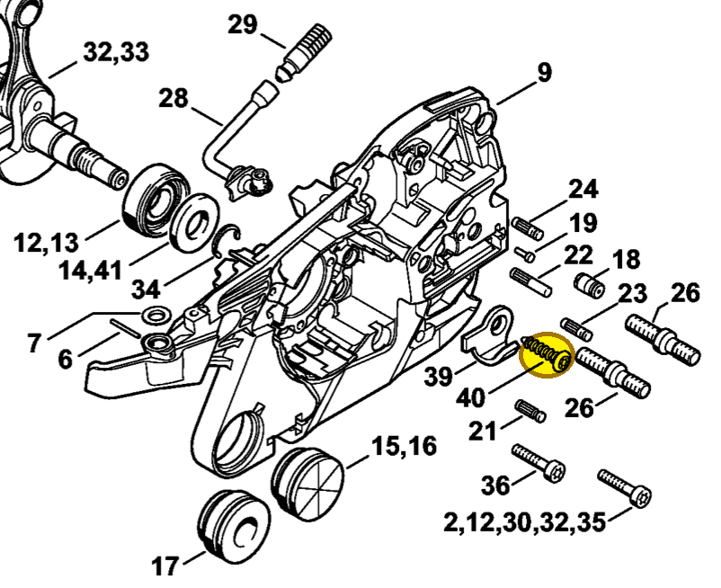

# Pan head self-tapping screw

**9074 477 4438**

Bin **A9** · **2** per kit · **AS1** supervision

[Part page](https://rduncangt.github.io/frk-management/parts/90744774438/) · [Field card PDF](field-card.pdf?raw=1) · [Avery label PDF](bag-label.pdf?raw=1) · [Offline reference](../../downloads/frk-part-reference.pdf?raw=1)

## MS 261 — chain catcher

IS-P6×30. Secures chain catcher [1141 656 7700](../11416567700/README.md) (item 39) to the crankcase.

**Item 40 · Qty listed: 1**

MS 261 C-M spare-parts list, 10/02/2023. Drawing p. 3; parts table p. 5.

Drawings © ANDREAS STIHL AG & Co. KG. Not to scale.
