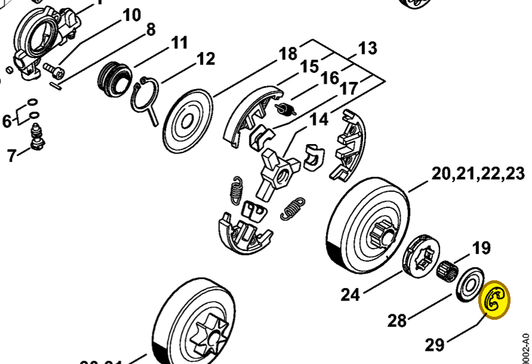
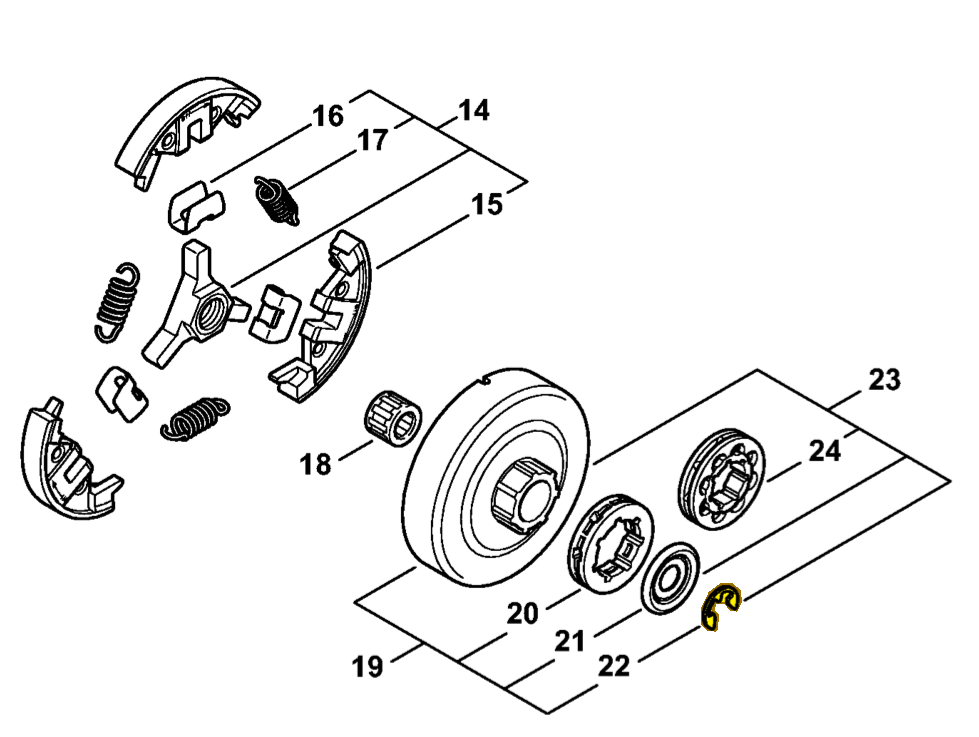

# E-clip 8x1.3

**9460 624 0801**

Bin **T3** · **12** per kit · **AS1** supervision

[Part page](https://rduncangt.github.io/frk-management/parts/94606240801/) · [Part reference sheet PDF](field-card.pdf?raw=1) · [Avery label PDF](bag-label.pdf?raw=1) · [Offline reference](../../downloads/frk-part-reference.pdf?raw=1)

## MS 261 — clutch drum

Retains washer [0000 958 1022](../00009581022/README.md). Included in rim sprocket kit [1141 007 1002](../11410071002/README.md).

**Item 29 · Qty listed: 1**

MS 261 C-M spare-parts list, 10/02/2023. Drawing p. 10; parts table p. 12.

## MS 462 — clutch drum

Retains washer [0000 958 1032](../00009581032/README.md). Included in rim sprocket kit [1128 007 1000](../11280071000/README.md).

**Item 22 · Qty listed: 1**

MS 462 C-M Z spare-parts list, 10/29/2024. Drawing p. 13; parts table p. 14.

[Suggest a correction](https://github.com/rduncangt/frk-management/issues/new?title=Parts+correction%3A+9460+624+0801+%E2%80%94+E-clip+8x1.3&body=%2A%2APart%3A%2A%2A+E-clip+8x1.3%0A%2A%2APart+number%3A%2A%2A+9460+624+0801%0A%2A%2ASaw+model%28s%29%3A%2A%2A+MS+261%2C+MS+462%0A%2A%2APart+reference%3A%2A%2A+https%3A%2F%2Frduncangt.github.io%2Ffrk-management%2Fparts%2F94606240801%2F%0A%0A%2A%2AWhat+needs+changing%3A%2A%2A%0A%0A%0A%2A%2AReference+or+photo+%28if+available%29%3A%2A%2A%0A) · GitHub sign-in required.

Drawings © ANDREAS STIHL AG & Co. KG. Not to scale.
