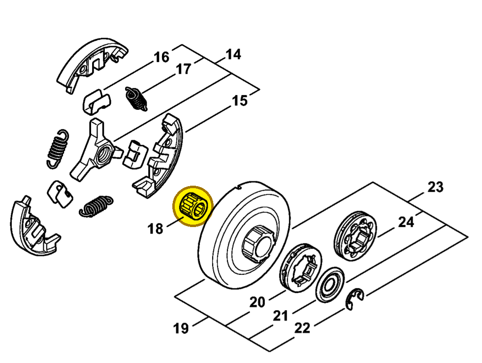

# Needle cage 10x16x12

**9512 933 2379**

Bin **A2** · **1** per kit · **AS1** supervision

[Part page](https://rduncangt.github.io/frk-management/parts/95129332379/) · [Field card PDF](field-card.pdf?raw=1) · [Avery label PDF](bag-label.pdf?raw=1) · [Offline reference](../../downloads/frk-part-reference.pdf?raw=1)

## MS 462 — clutch drum

Needle cage inside the clutch drum.

**Item 18 · Qty listed: 1**

MS 462 C-M Z spare-parts list, 10/29/2024. Drawing p. 13; parts table p. 14.

Drawings © ANDREAS STIHL AG & Co. KG. Not to scale.
