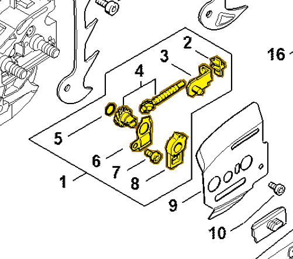
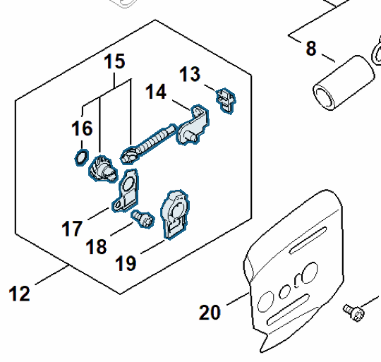

# Chain tensioner kit

**MA02 007 1002**

Bin **D1** · **2** per kit · **S2** supervision

[Part page](https://rduncangt.github.io/frk-management/parts/ma020071002/) · [Field card PDF](field-card.pdf?raw=1) · [Avery label PDF](bag-label.pdf?raw=1) · [Offline reference](../../downloads/frk-part-reference.pdf?raw=1)

## MS 261 — chain tensioner

Includes items 2–8, including tensioner slide [1125 640 1900](../11256401900/README.md#ms261-chain-tensioner) (item 3).

**Item 1 · Qty listed: 1**

MS 261 C-M spare-parts list, 10/02/2023. Drawing p. 15; parts table p. 16.

## MS 462 — chain tensioner

Includes items 13–19, including tensioner slide [1125 640 1900](../11256401900/README.md#ms462-chain-tensioner) (item 14).

**Item 12 · Qty listed: 1**

MS 462 C-M Z spare-parts list, 10/29/2024. Drawing p. 15; parts table p. 16.

Drawings © ANDREAS STIHL AG & Co. KG. Not to scale.
