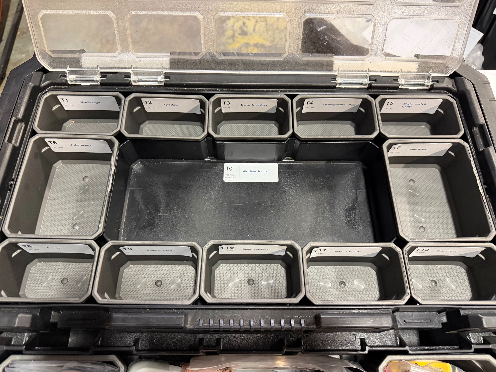
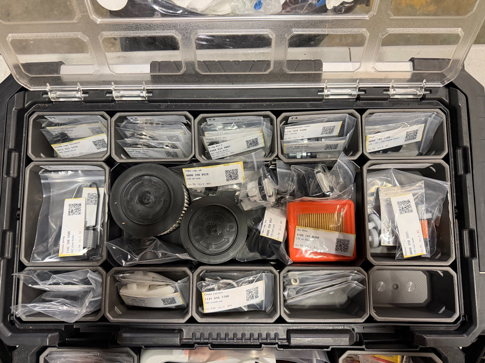
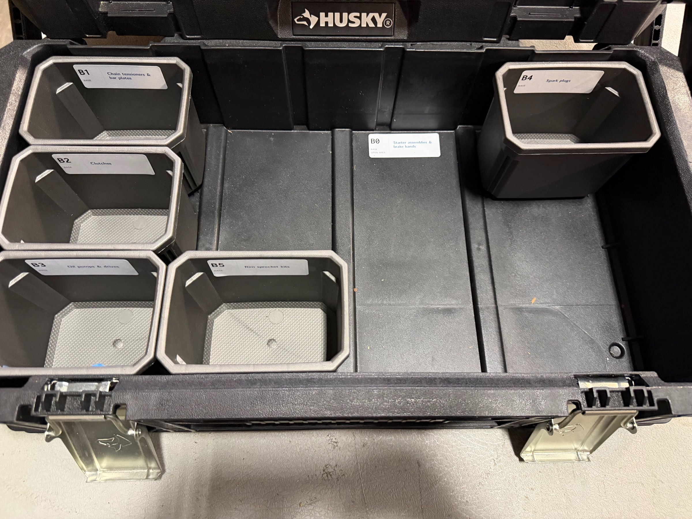
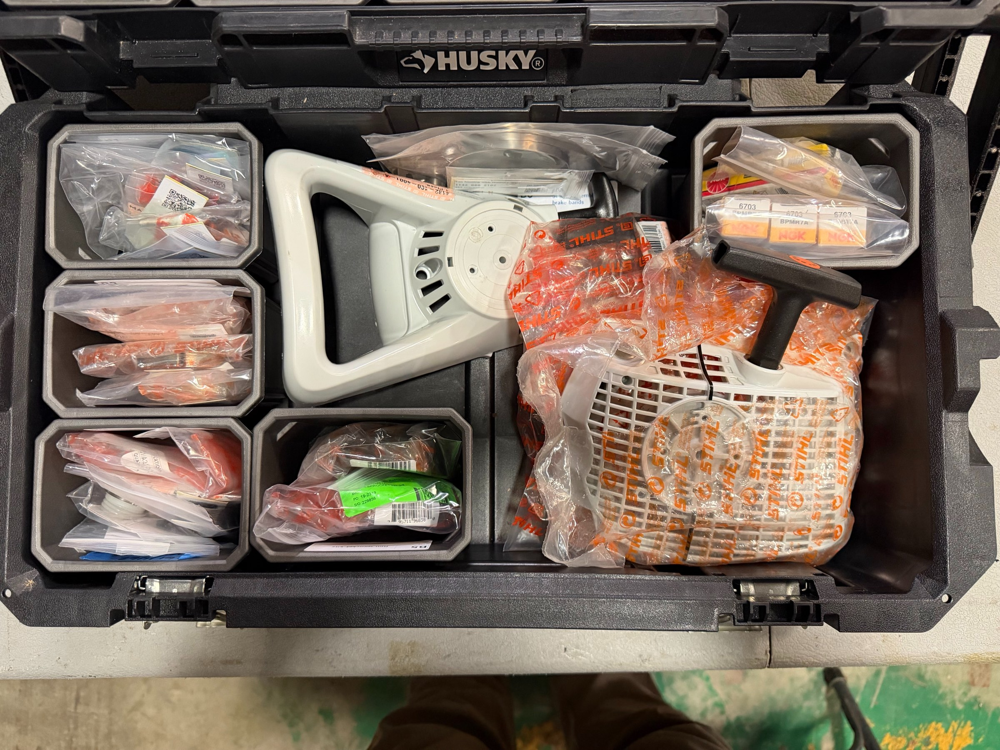
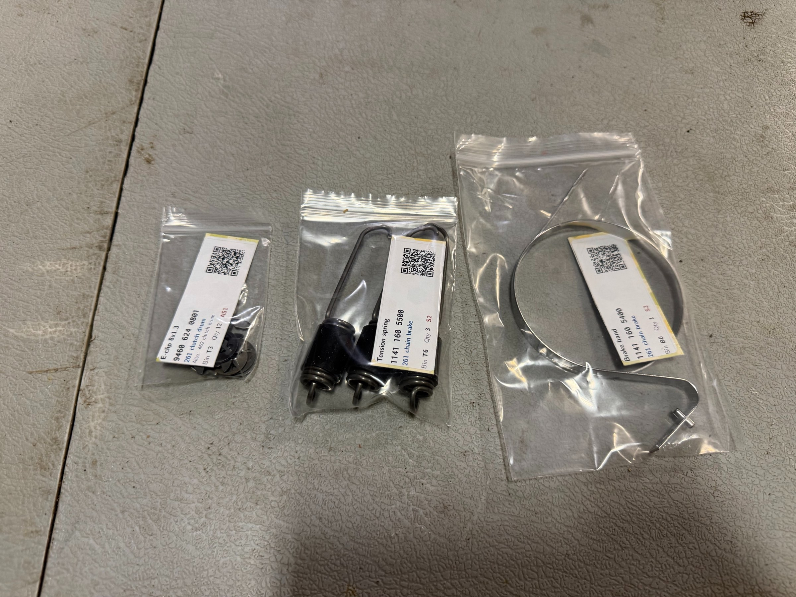

[← Field Repair Kits](README.md)

# Packing the kit

The kit layout, from empty bins to packed parts. Use the [box map](https://rduncangt.github.io/frk-management/downloads/frk-parts-boxmap.pdf) for locations and the [inventory checklist](https://rduncangt.github.io/frk-management/downloads/frk-parts-inventory.pdf) for quantities.

[Top tray](#top-tray) · [Base](#base) · [Bagged parts](#bagged-parts)

## Top tray

**Before packing.** Bin labels face forward. The center area is **T0**; **T12** is reserved for field extras.

**Packed.** Air filters and caps occupy T0, with smaller parts grouped in the surrounding bins.

## Base

**Before packing.** Bins surround **B0**, leaving space for the starter assemblies and brake bands.

**Packed.** Starter housings nest in B0, with the brake bands behind them.

## Bagged parts

E-clips, brake springs, and a brake band.

---

[Documents and materials](README.md#documents) · [Previous kit photos](legacy-photos.md)
