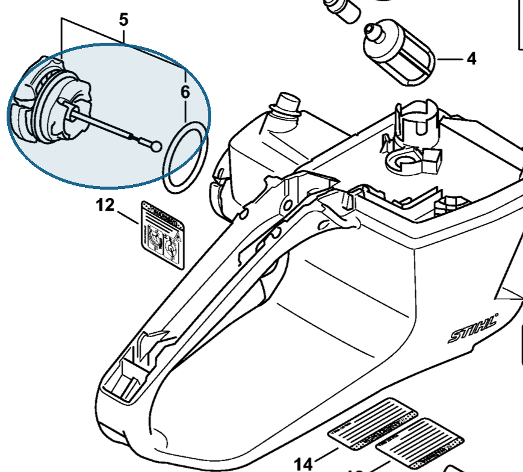

# Filler cap

**0000 350 0533**

Bin **O1** · **2** per kit · **AS1** supervision

[Part page](https://rduncangt.github.io/frk-management/parts/00003500533/) · [Field card PDF](field-card.pdf?raw=1) · [Avery label PDF](bag-label.pdf?raw=1) · [Offline reference](../../frk-part-reference.pdf?raw=1)

## MS 462 — fuel tank

Fuel filler cap; includes seal (item 6). The same part is used on the oil tank.

**Item 5 · Qty listed: 1**

MS 462 C-M Z spare-parts list, 10/29/2024. Drawing p. 23; parts table p. 24.

## MS 462 — oil tank

Oil filler cap in the crankcase; includes seal (item 9). Also listed in crankcase section B, table p. 7.

**Item 8 · Qty listed: 1**

MS 462 C-M Z spare-parts list, 10/29/2024. Drawing p. 3; parts table p. 4.

Drawings © ANDREAS STIHL AG & Co. KG. Not to scale.
