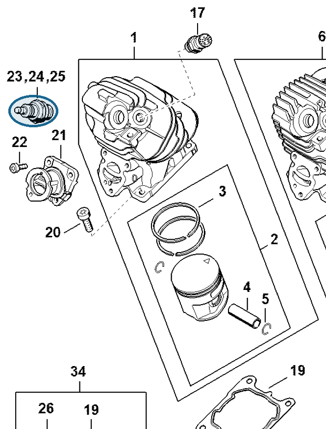

# Spark plug BPMR7A

**0000 400 7000**

Bin **D4** · **3** per kit · **S1** supervision

[Part page](https://rduncangt.github.io/frk-management/parts/00004007000/) · [Field card PDF](field-card.pdf?raw=1) · [Avery label PDF](bag-label.pdf?raw=1) · [Offline reference](../../frk-part-reference.pdf?raw=1)

## MS 261 — cylinder

Spark plug in the cylinder.

**Item 23 · Qty listed: 1**

MS 261 C-M spare-parts list, 10/02/2023. Drawing p. 8; parts table p. 9.

Drawings © ANDREAS STIHL AG & Co. KG. Not to scale.
