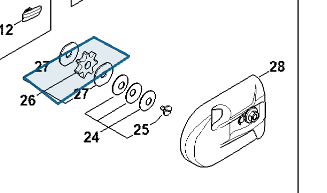

# Chain sprocket 3/8"P 7 teeth

**0000 640 2003**

Bin **A3** · **1** per kit · **S2** supervision

[Part page](https://rduncangt.github.io/frk-management/parts/00006402003/) · [Field card PDF](field-card.pdf?raw=1) · [Avery label PDF](bag-label.pdf?raw=1) · [Offline reference](../../frk-part-reference.pdf?raw=1)

## HT 135 — gear head

3/8-inch P pitch; 7 teeth. Includes two washers [4182 162 8900](../41821628900/README.md) (item 27).

**Item 26 · Qty listed: 1**

HT 135-Z spare-parts list, 10/28/2024. Drawing p. 17; parts table p. 18.

Drawings © ANDREAS STIHL AG & Co. KG. Not to scale.
