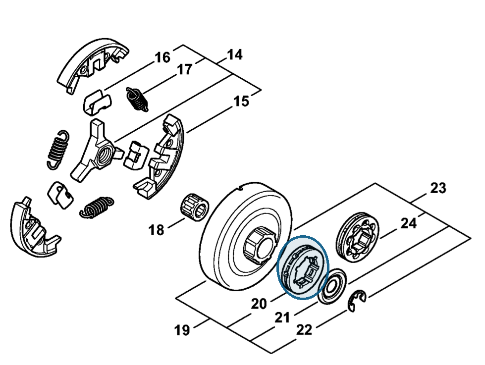

# Rim sprocket 3/8" 7T

**0000 642 1223**

Bin **A3** · **1** per kit · **AS1** supervision

[Part page](https://rduncangt.github.io/frk-management/parts/00006421223/) · [Field card PDF](field-card.pdf?raw=1) · [Avery label PDF](bag-label.pdf?raw=1) · [Offline reference](../../frk-part-reference.pdf?raw=1)

## MS 462 — rim sprocket

3/8-inch pitch; 7 teeth. The FRK also contains the separate 8-tooth kit [1128 007 1001](../11280071001/README.md).

**Item 20 · Qty listed: 1**

MS 462 C-M Z spare-parts list, 10/29/2024. Drawing p. 13; parts table p. 14.

Drawings © ANDREAS STIHL AG & Co. KG. Not to scale.
