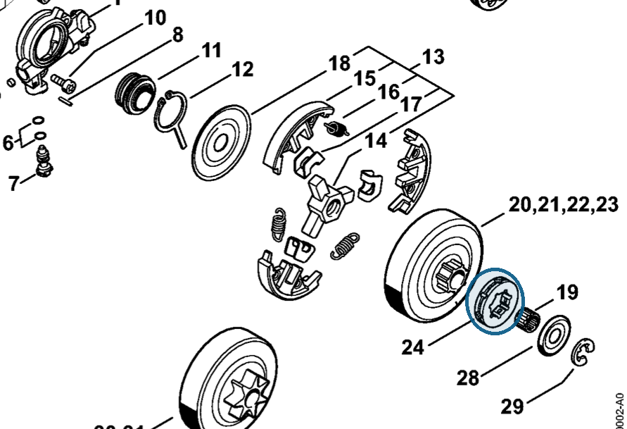

# Rim sprocket 0.325" 7T

**0000 642 1236**

Bin **A3** · **2** per kit · **AS1** supervision

[Part page](https://rduncangt.github.io/frk-management/parts/00006421236/) · [Field card PDF](field-card.pdf?raw=1) · [Avery label PDF](bag-label.pdf?raw=1) · [Offline reference](../../frk-part-reference.pdf?raw=1)

## MS 261 — rim sprocket

0.325-inch pitch; 7 teeth. Included in rim sprocket kit [1141 007 1002](../11410071002/README.md).

**Item 24 · Qty listed: 1**

MS 261 C-M spare-parts list, 10/02/2023. Drawing p. 10; parts table p. 11.

Drawings © ANDREAS STIHL AG & Co. KG. Not to scale.
