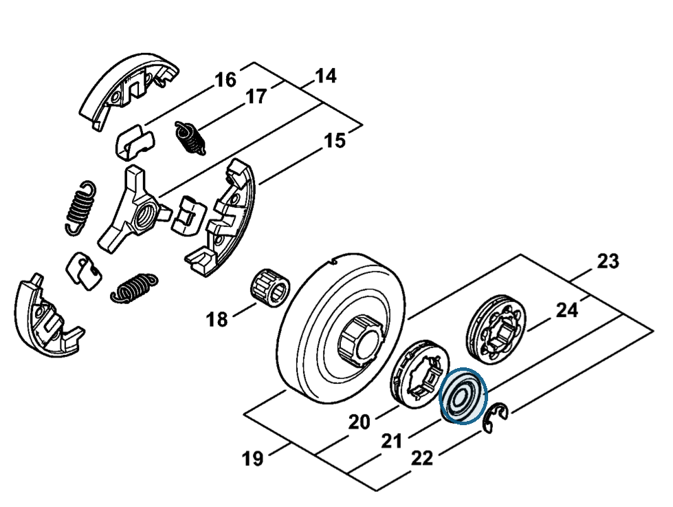

# Washer Ø 27 mm

**0000 958 1032**

Bin **A4** · **1** per kit · **AS1** supervision

[Part page](https://rduncangt.github.io/frk-management/parts/00009581032/) · [Field card PDF](field-card.pdf?raw=1) · [Avery label PDF](bag-label.pdf?raw=1) · [Offline reference](../../frk-part-reference.pdf?raw=1)

## MS 462 — clutch drum

Retained by E-clip [9460 624 0801](../94606240801/README.md#ms462-clutch-drum). Included in rim sprocket kit [1128 007 1001](../11280071001/README.md).

**Item 21 · Qty listed: 1**

MS 462 C-M Z spare-parts list, 10/29/2024. Drawing p. 13; parts table p. 14.

Drawings © ANDREAS STIHL AG & Co. KG. Not to scale.
