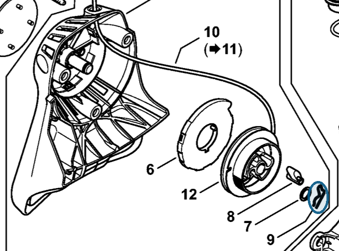

# Spring

**1118 195 3500**

Bin **AA** · **1** per kit · **S2** supervision

[Part page](https://rduncangt.github.io/frk-management/parts/11181953500/) · [Field card PDF](field-card.pdf?raw=1) · [Avery label PDF](bag-label.pdf?raw=1) · [Offline reference](../../frk-part-reference.pdf?raw=1)

## HT 135 — rewind starter

Pawl-retaining spring in rewind starter [4182 190 4001](../41821904001/README.md) (item 9).

**Item 9 · Qty listed: 1**

HT 135-Z spare-parts list, 10/28/2024. Drawing p. 5; parts table p. 6.

Drawings © ANDREAS STIHL AG & Co. KG. Not to scale.
