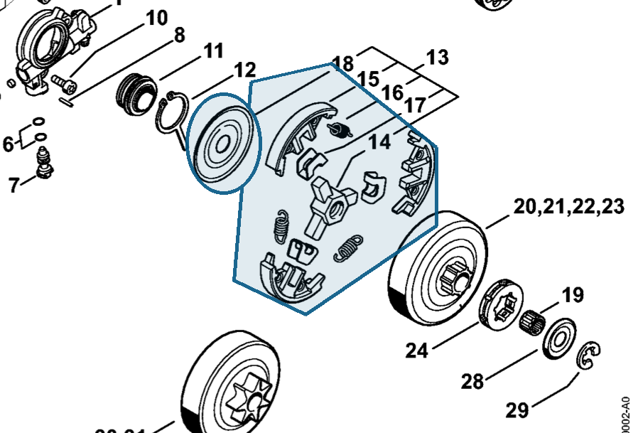

# Clutch

**1121 160 2051**

Bin **D2** · **2** per kit · **S2** supervision

[Part page](https://rduncangt.github.io/frk-management/parts/11211602051/) · [Field card PDF](field-card.pdf?raw=1) · [Avery label PDF](bag-label.pdf?raw=1) · [Offline reference](../../frk-part-reference.pdf?raw=1)

## MS 261 — clutch

Assembly includes items 14–18.

**Item 13 · Qty listed: 1**

MS 261 C-M spare-parts list, 10/02/2023. Drawing p. 10; parts table p. 11.

Drawings © ANDREAS STIHL AG & Co. KG. Not to scale.
