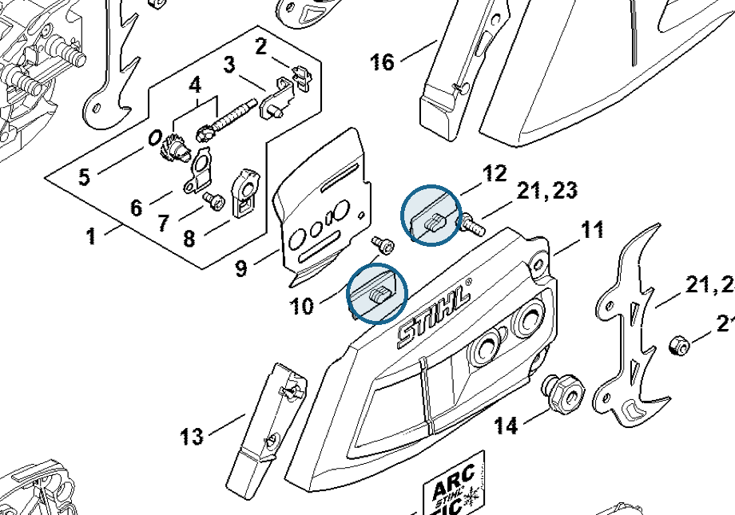
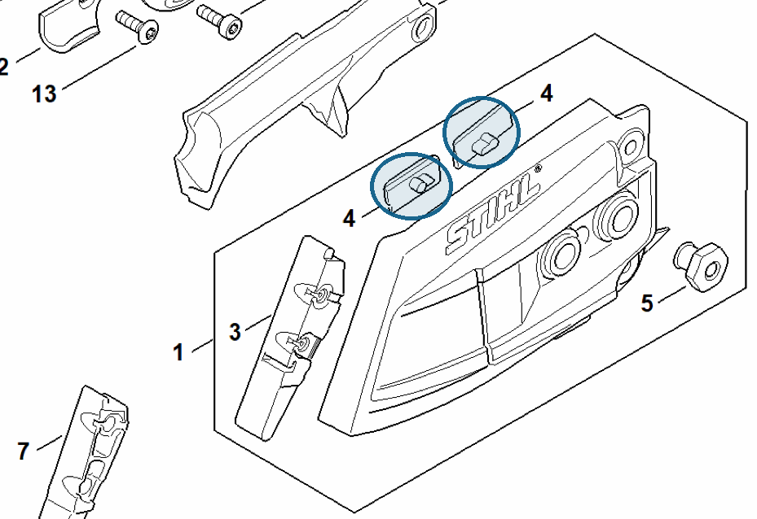

# Bumper strip

**1121 648 6610**

Bin **A7** · **8** per kit · **S1** supervision

[Part page](https://rduncangt.github.io/frk-management/parts/11216486610/) · [Field card PDF](field-card.pdf?raw=1) · [Avery label PDF](bag-label.pdf?raw=1) · [Offline reference](../../frk-part-reference.pdf?raw=1)

## MS 261 — chain sprocket cover

Two strips on the inside of the chain sprocket cover.

**Item 12 · Qty listed: 2**

MS 261 C-M spare-parts list, 10/02/2023. Drawing p. 15; parts table p. 16.

## MS 462 — chain sprocket cover

Two strips on the inside of the chain sprocket cover.

**Item 4 · Qty listed: 2**

MS 462 C-M Z spare-parts list, 10/29/2024. Drawing p. 17; parts table p. 18.

Drawings © ANDREAS STIHL AG & Co. KG. Not to scale.
