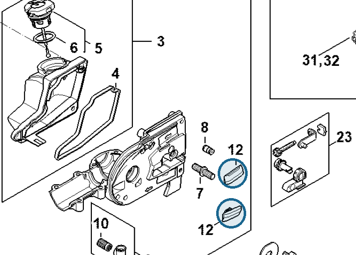

# Bumper strip

**1123 648 6600**

Bin **A7** · **4** per kit · **S1** supervision

[Part page](https://rduncangt.github.io/frk-management/parts/11236486600/) · [Field card PDF](field-card.pdf?raw=1) · [Avery label PDF](bag-label.pdf?raw=1) · [Offline reference](../../frk-part-reference.pdf?raw=1)

## HT 135 — chain sprocket cover

Two strips on the gear-head housing, behind the chain sprocket cover.

**Item 12 · Qty listed: 2**

HT 135-Z spare-parts list, 10/28/2024. Drawing p. 17; parts table p. 18.

Drawings © ANDREAS STIHL AG & Co. KG. Not to scale.
