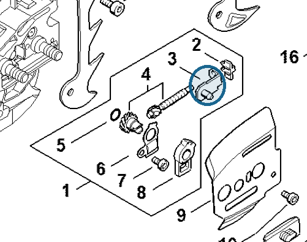
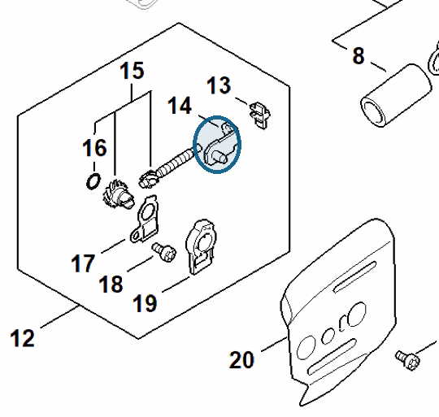

# Tensioner slide

**1125 640 1900**

Bin **D1** · **2** per kit · **S2** supervision

[Part page](https://rduncangt.github.io/frk-management/parts/11256401900/) · [Field card PDF](field-card.pdf?raw=1) · [Avery label PDF](bag-label.pdf?raw=1) · [Offline reference](../../frk-part-reference.pdf?raw=1)

## MS 261 — chain tensioner

Slide in chain tensioner kit [MA02 007 1002](../ma020071002/README.md#ms261-chain-tensioner).

**Item 3 · Qty listed: 1**

MS 261 C-M spare-parts list, 10/02/2023. Drawing p. 15; parts table p. 16.

## MS 462 — chain tensioner

Slide in chain tensioner kit [MA02 007 1002](../ma020071002/README.md#ms462-chain-tensioner).

**Item 14 · Qty listed: 1**

MS 462 C-M Z spare-parts list, 10/29/2024. Drawing p. 15; parts table p. 16.

Drawings © ANDREAS STIHL AG & Co. KG. Not to scale.
