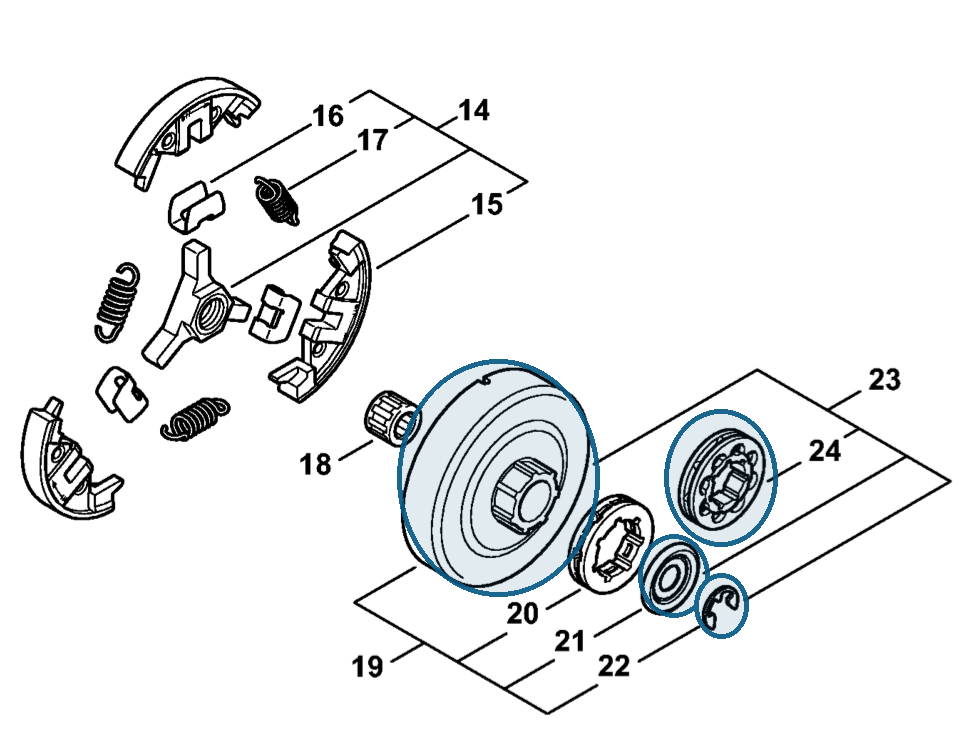

# Rim sprocket kit 3/8" 8T

**1128 007 1001**

Bin **D5** · **1** per kit · **AS1** supervision

[Part page](https://rduncangt.github.io/frk-management/parts/11280071001/) · [Field card PDF](field-card.pdf?raw=1) · [Avery label PDF](bag-label.pdf?raw=1) · [Offline reference](../../frk-part-reference.pdf?raw=1)

## MS 462 — rim sprocket kit

3/8-inch pitch; 8 teeth. Includes washer [0000 958 1032](../00009581032/README.md) (item 21), E-clip [9460 624 0801](../94606240801/README.md#ms462-clutch-drum) (item 22) and 8-tooth rim sprocket (item 24).

**Item 23 · Qty listed: 1**

MS 462 C-M Z spare-parts list, 10/29/2024. Drawing p. 13; parts table p. 14.

Drawings © ANDREAS STIHL AG & Co. KG. Not to scale.
