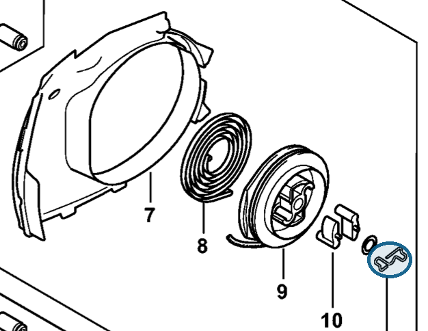

# Spring

**1128 195 3500**

Bin **AA** · **3** per kit · **S2** supervision

[Part page](https://rduncangt.github.io/frk-management/parts/11281953500/) · [Field card PDF](field-card.pdf?raw=1) · [Avery label PDF](bag-label.pdf?raw=1) · [Offline reference](../../frk-part-reference.pdf?raw=1)

## MS 261 — rewind starter

Pawl-retaining spring in fan housing [1141 080 2104](../11410802104/README.md) (item 10).

**Item 10 · Qty listed: 1**

MS 261 C-M spare-parts list, 10/02/2023. Drawing p. 19; parts table p. 20.

## MS 462 — rewind starter

Pawl-retaining spring in fan housing [1142 080 2102](../11420802102/README.md) (item 12).

**Item 12 · Qty listed: 1**

MS 462 C-M Z spare-parts list, 10/29/2024. Drawing p. 21; parts table p. 22.

Drawings © ANDREAS STIHL AG & Co. KG. Not to scale.
