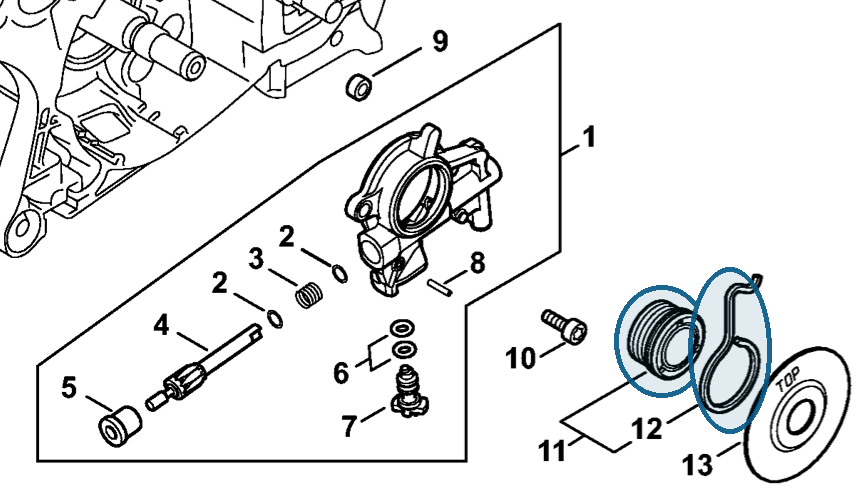

# Worm

**1128 640 7112**

Bin **D3** · **1** per kit · **S2** supervision

[Part page](https://rduncangt.github.io/frk-management/parts/11286407112/) · [Field card PDF](field-card.pdf?raw=1) · [Avery label PDF](bag-label.pdf?raw=1) · [Offline reference](../../frk-part-reference.pdf?raw=1)

## MS 462 — oil pump drive

Includes spring [1128 647 2400](../11286472400/README.md) (item 12). Drives oil pump [1142 640 3200](../11426403200/README.md).

**Item 11 · Qty listed: 1**

MS 462 C-M Z spare-parts list, 10/29/2024. Drawing p. 13; parts table p. 14.

Drawings © ANDREAS STIHL AG & Co. KG. Not to scale.
