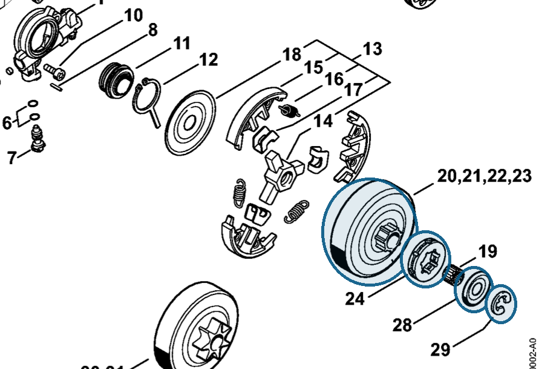

# Rim sprocket kit 0.325" 7T

**1141 007 1002**

Bin **D5** · **1** per kit · **AS1** supervision

[Part page](https://rduncangt.github.io/frk-management/parts/11410071002/) · [Field card PDF](field-card.pdf?raw=1) · [Avery label PDF](bag-label.pdf?raw=1) · [Offline reference](../../frk-part-reference.pdf?raw=1)

## MS 261 — rim sprocket kit

0.325-inch pitch; 7 teeth. Includes rim sprocket [0000 642 1236](../00006421236/README.md) (item 24), washer [0000 958 1022](../00009581022/README.md) (item 28) and E-clip [9460 624 0801](../94606240801/README.md#ms261-clutch-drum) (item 29).

**Item 20 · Qty listed: 1**

MS 261 C-M spare-parts list, 10/02/2023. Drawing p. 10; parts table p. 11.

Drawings © ANDREAS STIHL AG & Co. KG. Not to scale.
