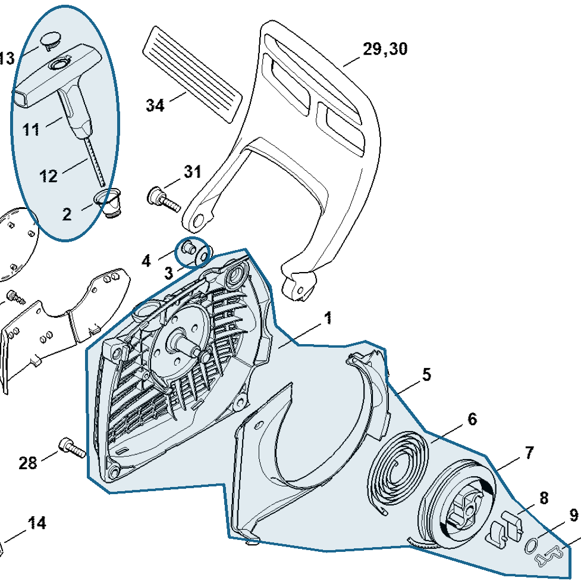

# Fan housing with rewind starter

**1141 080 2104**

Bin **O2** · **1** per kit · **S2** supervision

[Part page](https://rduncangt.github.io/frk-management/parts/11410802104/) · [Field card PDF](field-card.pdf?raw=1) · [Avery label PDF](bag-label.pdf?raw=1) · [Offline reference](../../frk-part-reference.pdf?raw=1)

## MS 261 — rewind starter

Complete fan housing with rewind starter; includes items 1–13, including spring [1128 195 3500](../11281953500/README.md#ms261-rewind-starter) (item 10).

**Item 1–13 · Qty listed: 1**

MS 261 C-M spare-parts list, 10/02/2023. Drawing p. 19; parts table p. 20.

Drawings © ANDREAS STIHL AG & Co. KG. Not to scale.
