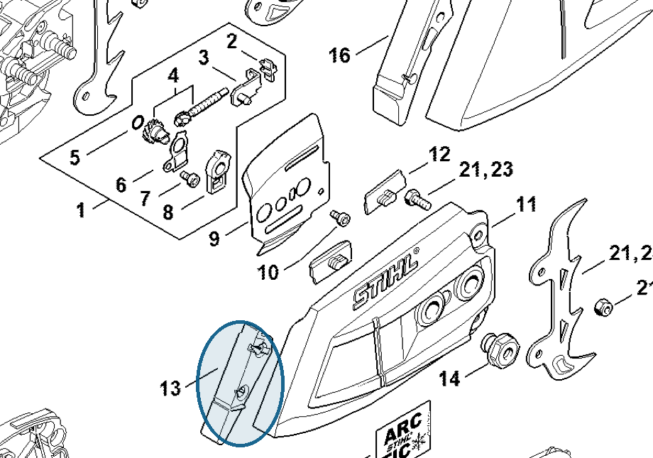

# Guard

**1141 656 1501**

Bin **A6** · **1** per kit · **S1** supervision

[Part page](https://rduncangt.github.io/frk-management/parts/11416561501/) · [Field card PDF](field-card.pdf?raw=1) · [Avery label PDF](bag-label.pdf?raw=1) · [Offline reference](../../frk-part-reference.pdf?raw=1)

## MS 261 — chain sprocket cover

Guard fitted to the chain sprocket cover.

**Item 13 · Qty listed: 1**

MS 261 C-M spare-parts list, 10/02/2023. Drawing p. 15; parts table p. 16.

Drawings © ANDREAS STIHL AG & Co. KG. Not to scale.
