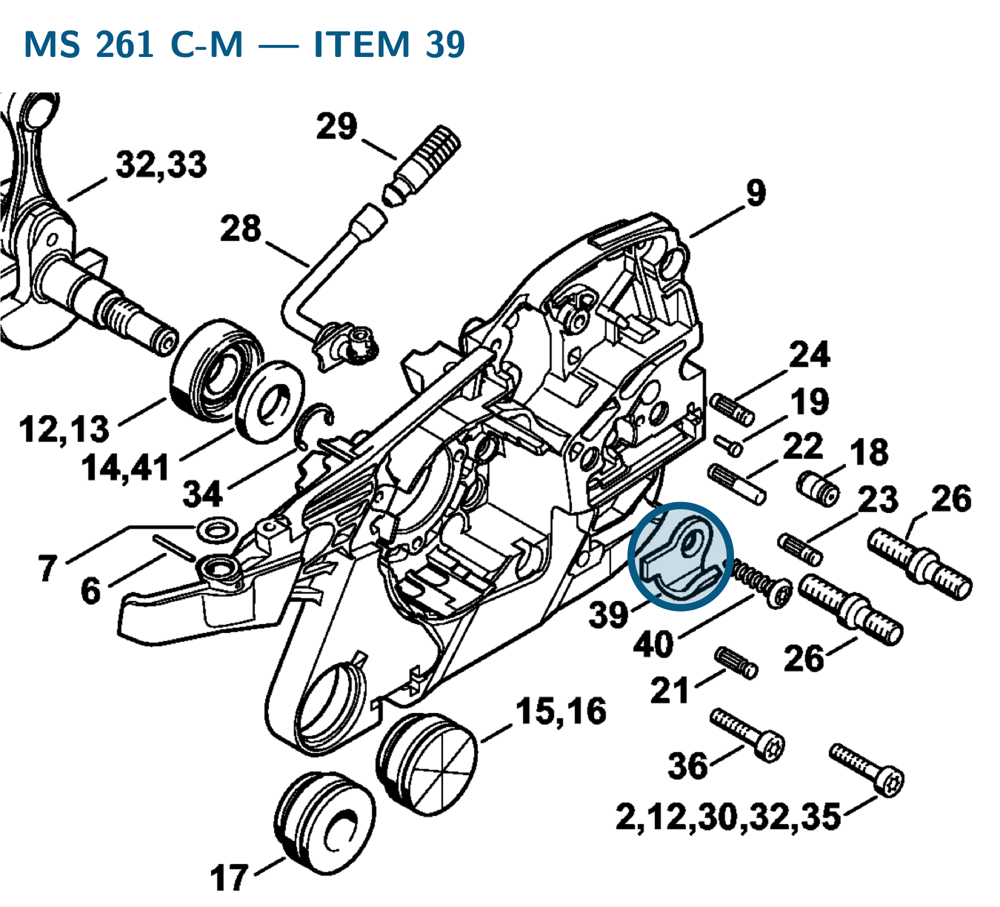

# Chain catcher

**1141 656 7700**

Bin A8 · 3 spares per FRK · AS1 supervision · 2″ × 3″ bag

[Field card (PDF)](field-card.pdf) · [Bag label (PDF)](bag-label.pdf)

| Saw | Application | Qty fitted | Item |
| :--- | :--- | :---: | :---: |
| MS 261 C-M | Clutch-side crankcase | 1 | 39 |

## MS 261 — chain catcher mounting

Mounts to the clutch-side crankcase with pan head self-tapping screw **9074 477 4438** (IS-P6×30; item 40).

**Item 39 · Qty fitted: 1**

Source: STIHL MS 261 C-M spare-parts list, edition 10/02/2023, Crankcase; drawing on PDF page 3, parts table on page 5.

Drawing © ANDREAS STIHL AG & Co. KG. Not to scale.
